# PATHS — Databases, ERD & Schema (DDBB)

This document is the complete data-layer reference for the PATHS hiring platform.
It covers **every datastore** the system uses and the **full schema** of each:

| # | Datastore | Engine | Role in PATHS |
|---|-----------|--------|---------------|
| 1 | **Relational** | **PostgreSQL 16** | System of record — 100 tables (tenancy, jobs, candidates, applications, interviews, decisions, billing, audit). |
| 2 | **Graph** | **PostgreSQL + Apache AGE** (`paths_graph`) | Relationship reasoning — candidate↔skill↔job↔company graph projected from the relational tables. |
| 3 | **Vector** | **Qdrant** | Semantic search & similarity — one embedding per entity + chunked RAG, 768-dim `nomic-embed-text`, cosine. |
| — | *Embeddings* | **Ollama** `nomic-embed-text` | Not a store; produces the 768-d vectors written to Qdrant. |
| — | *Generation* | **OpenRouter** | Not a store; LLM reasoning/generation. |

> **One source of truth.** PostgreSQL is authoritative. The graph and vector stores are
> **projections** kept in sync by the sync layer (`candidate_sync_service`, `job_sync_service`)
> and tracked by the `db_sync_status` / `job_vector_projection_status` tables. The rule is
> **one vertex per entity** (graph) and **one vector per entity** (Qdrant `paths_*` collections),
> plus auxiliary **chunk** collections for RAG.

---

## 0. Datastore topology

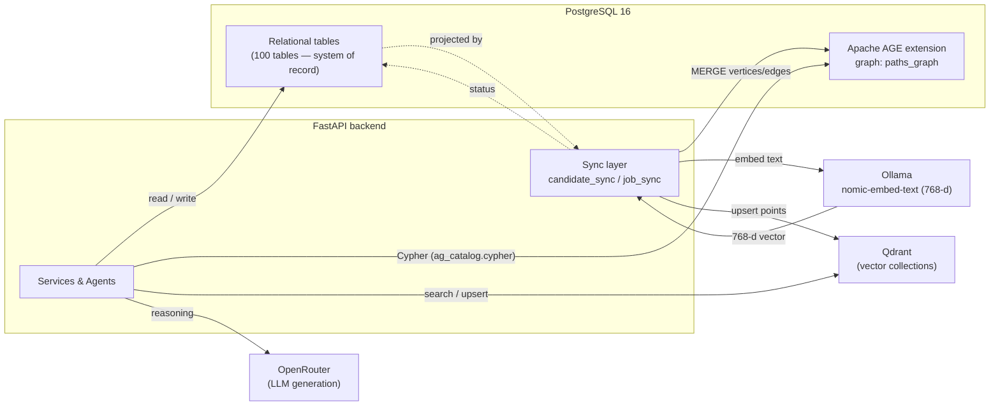

**Conventions across the relational schema**

- **Primary keys**: `UUID` (`gen_random_uuid()` / `uuid4`) except a few high-volume logs that use `BIGINT` (`audit_events`, `bias_audit_log`, `outbox_events`) and singletons (`platform_settings.id INTEGER`, `stripe_processed_events` keyed by event id).
- **Timestamps**: `created_at` / `updated_at` as `TIMESTAMPTZ`.
- **Flexible payloads**: `JSONB` columns for agent output, breakdowns, raw payloads, metadata.
- **Multi-tenancy**: most domain rows carry `organization_id`; candidates can be global (`owner_organization_id NULL`) or org-owned.
- **Soft-merge**: duplicate candidates are linked via `candidates.merged_into_candidate_id` rather than deleted.
- `[PK]` = primary key, `[NN]` = NOT NULL, `FK→` = foreign key. All FKs are listed in [§5](#5-master-foreign-key-reference).

---

# 1. PostgreSQL — Relational schema

The 100 tables are grouped into 12 functional domains. Each domain has an **ER diagram**
(entities + relationships) followed by the **complete column reference**.

## 1.1 Identity, Organizations & Access

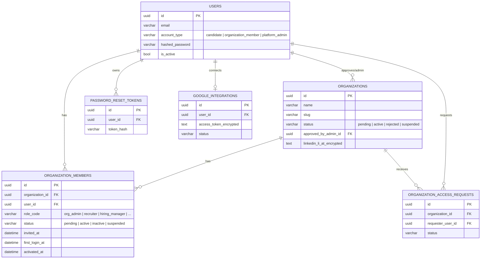

```text
users                         id[PK] email[NN] full_name[NN] hashed_password[NN]
                              account_type[NN] is_active[NN] created_at[NN] updated_at
organizations                 id[PK] name[NN] slug[NN] industry contact_email website
                              is_active[NN] status[NN] approved_by_admin_id→users approved_at
                              rejected_by_admin_id→users rejected_at rejection_reason
                              suspended_at suspended_reason linkedin_account_email
                              linkedin_li_at_encrypted linkedin_jsessionid_encrypted
                              linkedin_connected_at linkedin_connected_by_user_id→users
                              created_at[NN] updated_at
organization_members          id[PK] organization_id→organizations[NN] user_id→users[NN]
                              role_code[NN] is_active[NN] joined_at[NN] status[NN]
                              invited_at activated_at first_login_at invited_by_user_id
organization_access_requests  id[PK] organization_id→organizations[NN] requester_user_id→users[NN]
                              status[NN] submitted_at[NN] reviewed_by_admin_id→users reviewed_at
                              rejection_reason contact_role contact_phone additional_info
google_integrations           id[PK] user_id→users[NN] google_email access_token_encrypted
                              refresh_token_encrypted token_expiry scopes status[NN] last_error
password_reset_tokens         id[PK] user_id→users[NN] token_hash[NN] expires_at[NN] used_at
```

## 1.2 Billing & Platform Administration

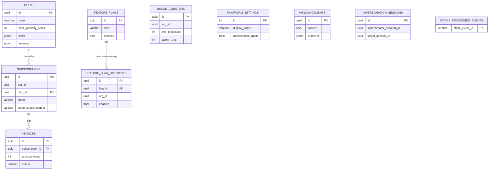

```text
plans                    id[PK] name[NN] code[NN] price_monthly_cents[NN] price_annual_cents[NN]
                         currency[NN] limits:jsonb[NN] features:jsonb[NN] is_public[NN]
                         stripe_price_id_monthly stripe_price_id_annual
subscriptions            id[PK] org_id[NN] plan_id→plans[NN] billing_cycle[NN] status[NN]
                         trial_ends_at current_period_start current_period_end
                         cancel_at_period_end[NN] stripe_customer_id stripe_subscription_id
invoices                 id[PK] org_id[NN] subscription_id→subscriptions amount_cents[NN]
                         currency[NN] status[NN] pdf_url period_start period_end due_at paid_at
                         stripe_invoice_id
usage_counters           id[PK] org_id[NN] period_start[NN] period_end[NN] cvs_processed[NN]
                         jobs_active[NN] agent_runs[NN] api_calls[NN] seats_used[NN]
stripe_processed_events  stripe_event_id[PK] processed_at[NN]
platform_settings        id[PK] display_name[NN] support_email legal_company_name
                         default_plan_id maintenance_mode[NN] email_templates:jsonb[NN]
feature_flags            id[PK] code[NN] description enabled[NN]
feature_flag_overrides   id[PK] flag_id→feature_flags[NN] org_id[NN] enabled[NN] set_by set_at[NN]
announcements            id[PK] content[NN] audience:jsonb[NN] scheduled_at sent_at
                         in_app_banner_enabled[NN] banner_color[NN] created_by
impersonation_sessions   id[PK] impersonator_account_id[NN] target_account_id[NN]
                         started_at[NN] ended_at reason
```

## 1.3 Companies, Jobs, Skills & JD structure

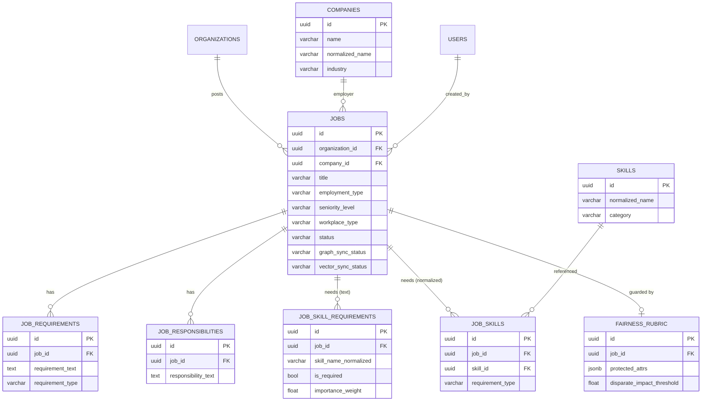

```text
companies               id[PK] name[NN] normalized_name[NN] website_url industry country city
locations               id[PK] country city region remote_type
skills                  id[PK] normalized_name[NN] category
jobs                    id[PK] organization_id→organizations source_type source_name source_job_id
                        source_url canonical_hash application_mode[NN] external_apply_url
                        visibility[NN] created_by_user_id→users source_platform source_external_id
                        company_id→companies company_name company_normalized title[NN]
                        title_normalized summary description_text description_html role_family
                        employment_type[NN] seniority_level experience_level requirements
                        min_years_experience max_years_experience workplace_type location_text
                        location_normalized location_mode[NN] country_code city department
                        salary_min salary_max salary_currency posted_at expires_at scraped_at
                        is_active[NN] status[NN] ingestion_status graph_sync_status
                        vector_sync_status last_graph_sync_at last_vector_sync_at last_imported_at
                        text_hash raw_payload_jsonb:jsonb
job_requirements        id[PK] job_id→jobs[NN] requirement_text[NN] requirement_type[NN]
job_responsibilities    id[PK] job_id→jobs[NN] responsibility_text[NN]
job_skill_requirements  id[PK] job_id→jobs[NN] skill_name_raw[NN] skill_name_normalized[NN]
                        importance_weight[NN] is_required[NN] extracted_by[NN]
job_skills              id[PK] job_id→jobs[NN] skill_id→skills[NN] requirement_type[NN]
                        importance_score years_required
fairness_rubric         id[PK] job_id→jobs[NN] protected_attrs:jsonb[NN]
                        disparate_impact_threshold[NN] enabled[NN]
```

## 1.4 Candidates & CV / Profile entities

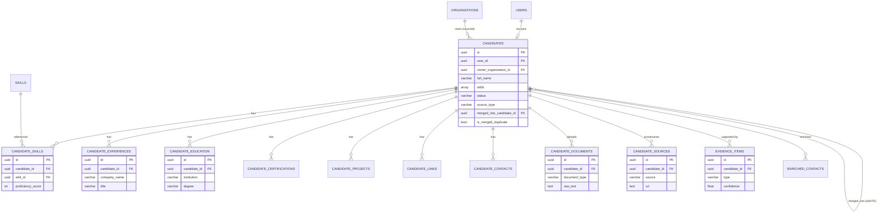

```text
candidates                id[PK] user_id→users full_name[NN] email phone current_title
                          location_text headline years_experience career_level skills:array
                          open_to_job_types:array open_to_workplace_settings:array
                          desired_job_titles:array desired_job_categories:array summary status[NN]
                          source_type[NN] source_platform owner_organization_id→organizations
                          merged_into_candidate_id→candidates is_merged_duplicate[NN]
                          duplicate_merge_group_id
candidate_skills          id[PK] candidate_id→candidates[NN] skill_id→skills[NN]
                          proficiency_score years_used evidence_text
candidate_experiences     id[PK] candidate_id→candidates[NN] company_name[NN] title[NN]
                          start_date end_date description
candidate_education       id[PK] candidate_id→candidates[NN] institution[NN] degree
                          field_of_study start_date end_date
candidate_certifications  id[PK] candidate_id→candidates[NN] name[NN] issuer issue_date expiry_date
candidate_projects        id[PK] candidate_id→candidates[NN] name[NN] description project_url
                          repository_url technologies:array start_date end_date source confidence
candidate_links           id[PK] candidate_id→candidates[NN] link_type[NN] url[NN] label
candidate_contacts        id[PK] candidate_id→candidates[NN] contact_type[NN] contact_value[NN]
                          is_primary[NN] is_verified[NN] confidence source
candidate_documents       id[PK] candidate_id→candidates[NN] document_type[NN] original_filename[NN]
                          mime_type[NN] storage_path_or_url[NN] raw_text checksum
candidate_sources         id[PK] candidate_id→candidates[NN] source[NN] url raw_blob_uri fetched_at
evidence_items            id[PK] candidate_id→candidates[NN] ingestion_job_id type[NN] field_ref
                          source_uri extracted_text confidence meta_json:jsonb
enriched_contacts         id[PK] candidate_id→candidates[NN] organization_id[NN] contact_type[NN]
                          original_value[NN] enriched_value confidence[NN] status[NN] source[NN]
                          provenance validated_at approved_by→users approved_at
```

## 1.5 Applications & Assessments (the pipeline)

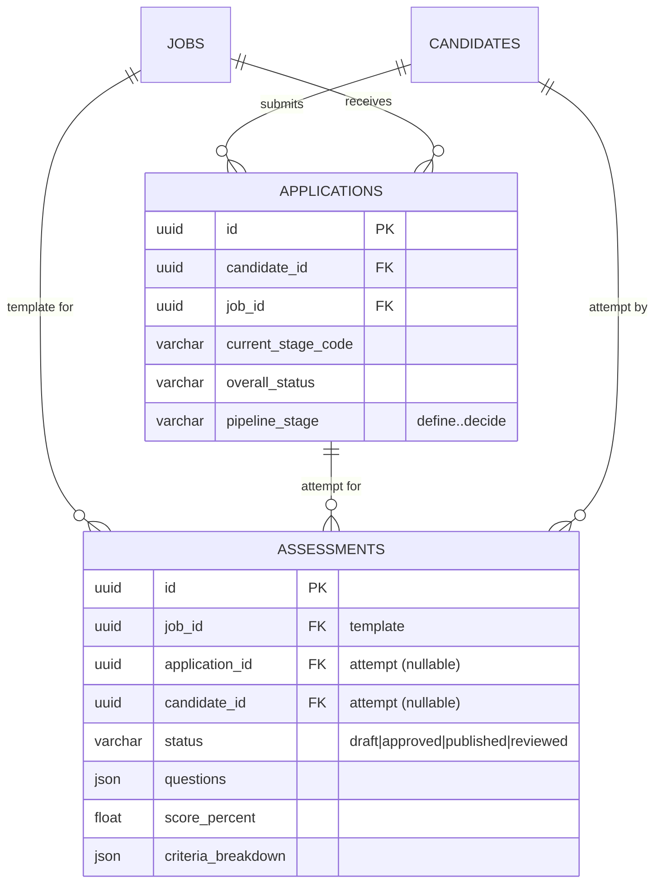

```text
applications  id[PK] candidate_id→candidates[NN] job_id→jobs[NN] application_type[NN]
              source_channel current_stage_code[NN] overall_status[NN] pipeline_stage[NN]
assessments   id[PK] organization_id[NN] application_id→applications candidate_id→candidates
              job_id→jobs[NN] title[NN] description assessment_type[NN] difficulty
              duration_minutes total_score status[NN] questions:json agent_metadata:json
              source_file_id source_file_name score max_score score_percent instructions
              submission_text submission_uri reviewer_notes criteria_breakdown:json
              created_by approved_by approved_at assigned_at submitted_at reviewed_at
```

> **Template vs. attempt:** a *published* assessment (`application_id NULL`, `candidate_id NULL`)
> is the job-level template; a candidate submission is a separate row with `application_id` +
> `candidate_id` set, `status='reviewed'`, and the AI grade in `score`/`score_percent`/`criteria_breakdown`.

## 1.6 Scoring, Matching & Screening

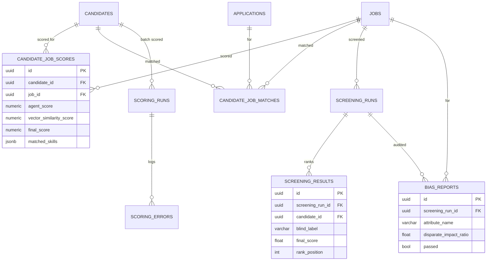

```text
candidate_job_scores  id[PK] candidate_id→candidates[NN] job_id→jobs[NN] agent_score[NN]
                      vector_similarity_score[NN] final_score[NN] relevance_score role_family
                      match_classification criteria_breakdown:jsonb matched_skills:jsonb
                      missing_required_skills:jsonb missing_preferred_skills:jsonb strengths:jsonb
                      weaknesses:jsonb explanation recommendation confidence model_name
                      prompt_version[NN] scoring_status[NN]
candidate_job_matches id[PK] candidate_id→candidates[NN] job_id→jobs[NN] application_id→applications
                      overall_score skill_score experience_score education_score semantic_score
                      graph_score fairness_adjusted_score explanation evidence:jsonb model_version
scoring_runs          id[PK] candidate_id→candidates[NN] started_at[NN] finished_at
                      total_relevant_jobs[NN] scored_jobs[NN] skipped_jobs[NN] failed_jobs[NN]
                      status[NN] error_message metadata:jsonb
scoring_errors        id[PK] scoring_run_id→scoring_runs candidate_id job_id error_type
                      error_message metadata:jsonb
scoring_criteria      id[PK] name[NN] description weight[NN] is_active[NN]
screening_runs        id[PK] organization_id[NN] job_id→jobs[NN] source[NN] top_k[NN] status[NN]
                      total_candidates_scanned candidates_passed_filter candidates_scored
                      candidates_failed error_message metadata_json:json started_at finished_at
screening_results     id[PK] screening_run_id→screening_runs[NN] candidate_id→candidates[NN]
                      job_id→jobs[NN] blind_label[NN] rank_position agent_score[NN]
                      vector_similarity_score[NN] final_score[NN] relevance_score recommendation
                      match_classification criteria_breakdown:json matched_skills:json
                      missing_required_skills:json missing_preferred_skills:json strengths:json
                      weaknesses:json explanation status[NN]
bias_reports          id[PK] screening_run_id→screening_runs[NN] organization_id[NN] job_id→jobs[NN]
                      attribute_name[NN] group_label[NN] selection_count[NN] total_count[NN]
                      selection_rate[NN] disparate_impact_ratio threshold[NN] passed[NN]
```

## 1.7 Candidate Pools & Org Matching / Outreach (org talent search)

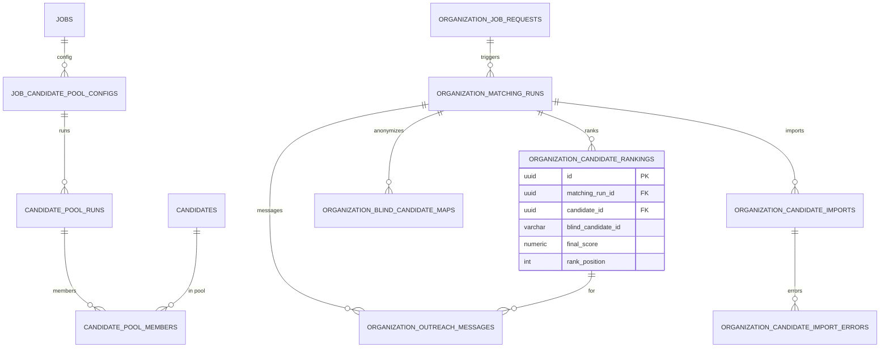

```text
organization_candidate_source_settings  id[PK] organization_id→organizations[NN]
                          use_paths_profiles_default[NN] use_sourced_candidates_default[NN]
                          use_uploaded_candidates_default[NN] use_job_fair_candidates_default[NN]
                          use_ats_candidates_default[NN] default_top_k[NN]
                          default_min_profile_completeness[NN] default_min_evidence_confidence[NN]
                          updated_by_user_id→users
job_candidate_pool_configs  id[PK] job_id→jobs[NN] organization_id→organizations[NN]
                          use_paths_profiles[NN] use_sourced_candidates[NN]
                          use_uploaded_candidates[NN] use_job_fair_candidates[NN]
                          use_ats_candidates[NN] top_k[NN] min_profile_completeness[NN]
                          min_evidence_confidence[NN] filters_json:jsonb created_by_user_id→users
candidate_pool_runs       id[PK] job_id→jobs[NN] organization_id→organizations[NN]
                          config_id→job_candidate_pool_configs total_candidates_found[NN]
                          duplicates_removed[NN] eligible_candidates[NN] excluded_candidates[NN]
                          source_breakdown:jsonb status[NN] error_message
                          created_by_user_id→users completed_at
candidate_pool_members    id[PK] pool_run_id→candidate_pool_runs[NN] candidate_id→candidates[NN]
                          source_type[NN] eligibility_status[NN] exclusion_reason
                          profile_completeness evidence_confidence
organization_job_requests id[PK] organization_id[NN] job_id→jobs title[NN] summary description
                          responsibilities:jsonb requirements:jsonb required_skills:jsonb
                          preferred_skills:jsonb education_requirements:jsonb min_years_experience
                          max_years_experience seniority_level location_text workplace_type
                          employment_type salary_min salary_max salary_currency role_family
                          top_k[NN] source_type[NN] status[NN] created_by
organization_matching_runs  id[PK] organization_id[NN] job_request_id→organization_job_requests
                          job_id→jobs path_type[NN] top_k[NN] total_candidates[NN]
                          relevant_candidates[NN] scored_candidates[NN] shortlisted_candidates[NN]
                          failed_candidates[NN] status[NN] error_message metadata:jsonb
                          started_at[NN] finished_at
organization_candidate_rankings  id[PK] organization_id[NN] matching_run_id→organization_matching_runs[NN]
                          job_request_id→organization_job_requests job_id→jobs
                          candidate_id→candidates[NN] blind_candidate_id[NN] rank_position
                          agent_score[NN] vector_similarity_score[NN] final_score[NN]
                          relevance_score criteria_breakdown:jsonb matched_skills:jsonb
                          missing_required_skills:jsonb missing_preferred_skills:jsonb
                          strengths:jsonb weaknesses:jsonb explanation recommendation
                          match_classification status[NN]
organization_blind_candidate_maps  id[PK] organization_id[NN]
                          matching_run_id→organization_matching_runs[NN] candidate_id→candidates[NN]
                          blind_candidate_id[NN] de_anonymized[NN] de_anonymized_at
                          de_anonymized_by de_anonymization_reason
organization_candidate_imports  id[PK] organization_id[NN]
                          matching_run_id→organization_matching_runs[NN] file_name total_rows[NN]
                          valid_rows[NN] imported_candidates[NN] updated_candidates[NN]
                          failed_rows[NN] status[NN] error_message metadata:jsonb finished_at
organization_candidate_import_errors  id[PK] import_id→organization_candidate_imports
                          matching_run_id→organization_matching_runs row_number cv_url
                          error_type error_message raw_row:jsonb
organization_outreach_messages  id[PK] organization_id[NN]
                          matching_run_id→organization_matching_runs[NN]
                          ranking_id→organization_candidate_rankings job_id→jobs
                          candidate_id→candidates blind_candidate_id[NN] recipient_email
                          subject[NN] body[NN] booking_link reply_deadline_at status[NN]
                          provider provider_message_id approved_by approved_at sent_at error_message
```

## 1.8 Interviews & Interview Intelligence

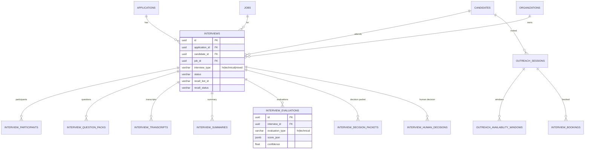

```text
outreach_sessions             id[PK] candidate_id→candidates[NN] job_id→jobs hr_user_id→users
                              organization_id→organizations[NN] token_hash[NN] status[NN] subject
                              email_body recipient_email interview_type interview_duration_minutes[NN]
                              buffer_minutes[NN] timezone[NN] expires_at sent_at opened_at booked_at
                              last_error meta_json:jsonb
outreach_availability_windows id[PK] outreach_session_id→outreach_sessions[NN] day_of_week[NN]
                              start_time[NN] end_time[NN] timezone[NN]
interview_bookings            id[PK] outreach_session_id→outreach_sessions[NN]
                              candidate_id→candidates[NN] job_id→jobs hr_user_id→users
                              selected_start_time[NN] selected_end_time[NN] timezone[NN]
                              google_calendar_event_id google_meet_link status[NN] meta_json:jsonb
interviews                    id[PK] application_id→applications[NN] candidate_id→candidates[NN]
                              job_id→jobs[NN] organization_id→organizations[NN] interview_type[NN]
                              status[NN] scheduled_start_time scheduled_end_time timezone
                              meeting_provider meeting_url calendar_event_id raw_calendar_payload:jsonb
                              hr_notes created_by_user_id→users recall_recording_mode recall_bot_id
                              recall_recording_id recall_transcript_id recall_status
                              recall_status_message recall_transcript_json:jsonb recall_transcript_path
interview_participants        id[PK] interview_id→interviews[NN] user_id→users role[NN]
                              attendance_status
interview_question_packs      id[PK] interview_id→interviews[NN] question_pack_type[NN]
                              generated_by_agent questions_json:jsonb[NN] approved_by_hr[NN] approved_at
interview_transcripts         id[PK] interview_id→interviews[NN] transcript_text[NN]
                              transcript_source[NN] language quality_hint
interview_summaries           id[PK] interview_id→interviews[NN] summary_json:jsonb[NN]
                              generated_by_agent
interview_evaluations         id[PK] interview_id→interviews[NN] evaluation_type[NN]
                              score_json:jsonb[NN] strengths_json:jsonb weaknesses_json:jsonb
                              evidence_json:jsonb recommendation confidence
interview_decision_packets    id[PK] interview_id→interviews[NN] application_id→applications[NN]
                              candidate_id→candidates[NN] job_id→jobs[NN] recommendation
                              final_score confidence decision_packet_json:jsonb[NN]
                              human_review_required[NN]
interview_human_decisions     id[PK] interview_id→interviews[NN] decided_by→users[NN]
                              final_decision[NN] hr_notes override_reason
```

## 1.9 Decision Support & Growth Plans

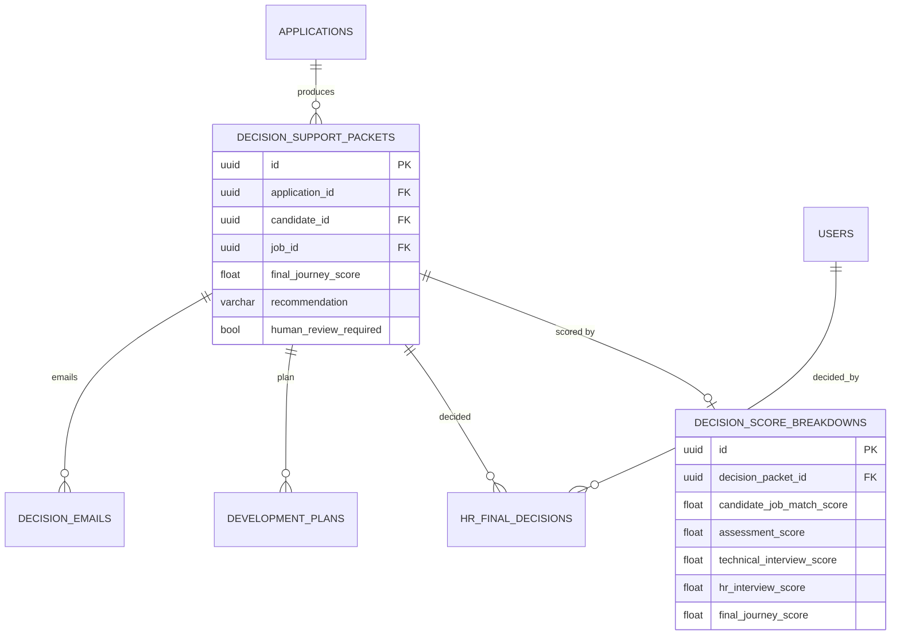

```text
decision_support_packets  id[PK] organization_id→organizations[NN] job_id→jobs[NN]
                          candidate_id→candidates[NN] application_id→applications[NN]
                          generated_by_agent model_provider model_name final_journey_score
                          recommendation confidence packet_json:jsonb[NN] evidence_json:jsonb
                          compliance_status human_review_required[NN]
decision_score_breakdowns id[PK] decision_packet_id→decision_support_packets[NN]
                          candidate_job_match_score assessment_score technical_interview_score
                          hr_interview_score experience_alignment_score evidence_confidence_score
                          final_journey_score scoring_formula_version[NN] explanation_json:jsonb
hr_final_decisions        id[PK] decision_packet_id→decision_support_packets[NN]
                          organization_id→organizations[NN] job_id→jobs[NN]
                          candidate_id→candidates[NN] application_id→applications[NN]
                          decided_by_user_id→users[NN] ai_recommendation final_hr_decision[NN]
                          override_reason hr_notes decided_at[NN]
decision_emails           id[PK] decision_packet_id→decision_support_packets[NN]
                          organization_id→organizations[NN] candidate_id→candidates[NN]
                          job_id→jobs[NN] application_id→applications[NN] email_type[NN]
                          subject[NN] body[NN] generated_by_agent status[NN]
                          approved_by_user_id→users sent_at
development_plans         id[PK] decision_packet_id→decision_support_packets[NN]
                          organization_id→organizations[NN] job_id→jobs[NN]
                          candidate_id→candidates[NN] application_id→applications[NN]
                          plan_type[NN] generated_by_agent model_provider model_name
                          plan_json:jsonb[NN] summary
growth_plans              id[PK] organization_id[NN] candidate_id[NN] job_id decision_id
                          agent_run_id generated_by_run_id skill_gaps:jsonb
                          learning_resources:jsonb milestones:jsonb overall_completion
                          status[NN] candidate_facing_message
```

## 1.10 Sourcing (external/LinkedIn) & Company Knowledge

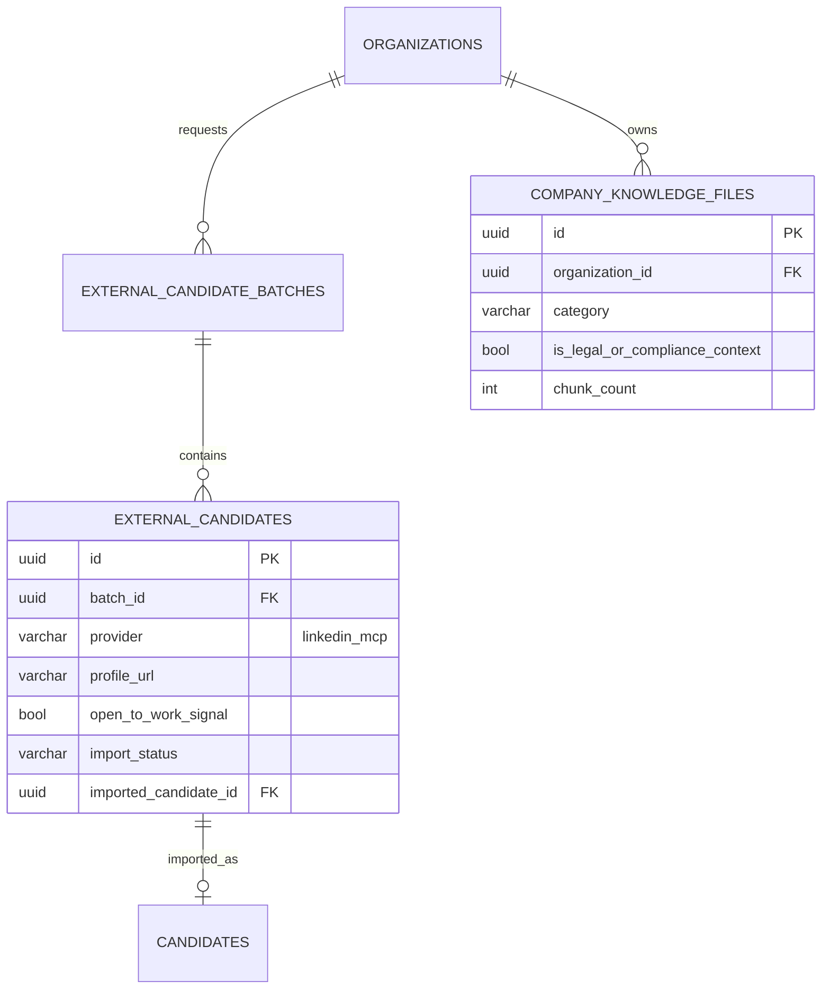

```text
external_candidate_batches  id[PK] organization_id→organizations[NN] provider[NN]
                            requested_by_user_id→users role_category[NN] requested_count[NN]
                            fetched_count[NN] status[NN] keywords:jsonb location error_message
external_candidates         id[PK] batch_id→external_candidate_batches[NN]
                            organization_id→organizations[NN] provider[NN] external_id profile_url
                            full_name headline current_title current_company location email phone
                            skills:jsonb[NN] open_to_work_signal open_to_work_evidence
                            technical_role_evidence raw_payload:jsonb import_status[NN]
                            imported_candidate_id→candidates imported_at
company_knowledge_files     id[PK] organization_id→organizations[NN] uploaded_by_user_id→users
                            file_name[NN] file_type[NN] file_size[NN] storage_path[NN] category[NN]
                            description status[NN] is_legal_or_compliance_context[NN]
                            chunk_count[NN] error_message indexed_at
```

## 1.11 Duplicates, Merge, Anonymization, Bias & HITL

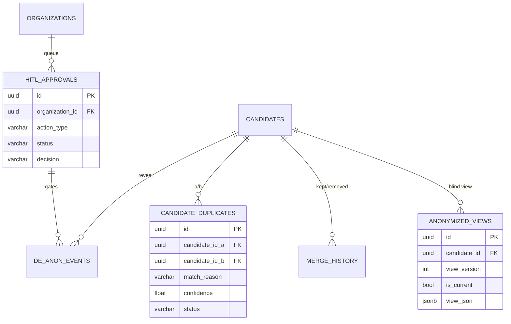

```text
candidate_duplicates  id[PK] candidate_id_a→candidates[NN] candidate_id_b→candidates[NN]
                      organization_id→organizations[NN] match_reason[NN] match_value[NN]
                      confidence[NN] status[NN] reviewed_by→users reviewed_at notes
                      merged_into_candidate_id→candidates
candidate_merge_audit id[PK] organization_id→organizations[NN] canonical_candidate_id→candidates[NN]
                      merged_candidate_ids:jsonb[NN] merge_reason[NN]
                      performed_by_user_id→users details:jsonb
merge_history         id[PK] organization_id→organizations[NN] kept_candidate_id→candidates[NN]
                      removed_candidate_id→candidates[NN] merged_by→users[NN] merged_at[NN]
                      merge_reason audit_log:jsonb
anonymized_views      id[PK] candidate_id→candidates[NN] view_version[NN] is_current[NN]
                      view_json:jsonb[NN] stripped_fields:jsonb source_hash
de_anon_events        id[PK] org_id→organizations[NN] candidate_id→candidates[NN]
                      requested_by_user_id→users approver_user_id→users approval_id→hitl_approvals
                      purpose[NN] granted_at denied_at requested_at[NN]
hitl_approvals        id[PK] organization_id→organizations[NN] action_type[NN] status[NN]
                      priority[NN] entity_type[NN] entity_id[NN] entity_label[NN]
                      requested_by_user_id→users requested_by_name[NN] requested_at[NN]
                      reviewed_by_user_id→users reviewed_by_name reviewed_at decision reason
                      expires_at meta_json:jsonb
bias_flags            id[PK] org_id→organizations[NN] scope[NN] scope_id[NN] rule[NN]
                      severity[NN] status[NN] detail:jsonb reviewed_by reviewed_at
bias_audit_log        id[PK,bigint] org_id event_type[NN] candidate_id job_id actor_id
                      detail_json:jsonb
```

## 1.12 Ingestion, Sync, Agent Runs, Audit & Analytics (plumbing)

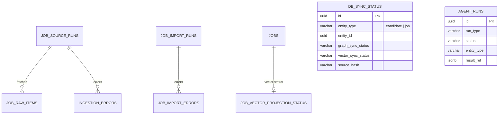

```text
ingestion_jobs            id[PK] candidate_id document_id status[NN] stage[NN] error_message
                          metadata_json:jsonb
job_source_runs           id[PK] source_type[NN] source_name[NN] started_at[NN] finished_at
                          status[NN] fetched_count[NN] normalized_count[NN] inserted_count[NN]
                          updated_count[NN] duplicate_count[NN] failed_count[NN]
                          error_summary_jsonb:jsonb created_by
job_raw_items             id[PK] source_run_id→job_source_runs[NN] source_type[NN] source_name[NN]
                          source_job_id source_url raw_payload_jsonb:jsonb fetch_status[NN]
ingestion_errors          id[PK] source_run_id→job_source_runs source_type[NN] source_name[NN]
                          source_url stage[NN] error_type[NN] error_message[NN] details_jsonb:jsonb
job_import_runs           id[PK] source_platform[NN] started_at[NN] finished_at requested_limit[NN]
                          scraped_count[NN] valid_count[NN] inserted_count[NN] updated_count[NN]
                          skipped_count[NN] failed_count[NN] graph_synced_count[NN]
                          vector_synced_count[NN] status[NN] error_message metadata:jsonb
job_import_errors         id[PK] import_run_id→job_import_runs source_platform source_url job_title
                          company_name error_type error_message raw_payload:jsonb
job_scraper_state         id[PK] source_platform[NN] company_offset[NN] last_run_at
                          last_imported_count[NN]
job_vector_projection_status  id[PK] job_id→jobs[NN] vector_backend[NN] collection_name[NN]
                          point_id[NN] embedding_model[NN] projection_status[NN]
db_sync_status            id[PK] entity_type[NN] entity_id[NN] graph_sync_status[NN]
                          vector_sync_status[NN] graph_last_synced_at vector_last_synced_at
                          graph_error vector_error retry_count[NN] source_hash
agent_runs                id[PK] organization_id[NN] run_type[NN] status[NN] current_node
                          triggered_by entity_type entity_id input_ref:jsonb result_ref:jsonb
                          error started_at finished_at
audit_events              id[PK,bigint] actor_type[NN] actor_id[NN] entity_type[NN] entity_id[NN]
                          action[NN] before_jsonb:jsonb after_jsonb:jsonb
audit_logs                id[PK] actor_user_id→users action[NN] entity_type[NN] entity_id
                          old_value:jsonb new_value:jsonb metadata:jsonb
analytics_events          id[PK] org_id[NN] entity_type[NN] entity_id event_type[NN] actor_id
                          payload:jsonb[NN]
outbox_events             id[PK,bigint] aggregate_type[NN] aggregate_id[NN] event_type[NN]
                          payload_json:jsonb[NN] status[NN] processed_at
```

---

# 2. PostgreSQL + Apache AGE — Graph schema

The graph lives **inside PostgreSQL** via the Apache AGE extension, in a single graph named
**`paths_graph`**. It is queried with `SELECT * FROM ag_catalog.cypher('paths_graph', $$ ... $$)`.
It is a **projection of the relational tables** (one vertex per entity, keyed by the relational
UUID, e.g. `candidate_id`, `job_id`), maintained by the sync layer. It is used for relationship
reasoning (shared skills, candidate↔job overlap, company graph).

### 2.1 Node (vertex) labels

| Label | Keyed by | Projected from | Key properties |
|-------|----------|----------------|----------------|
| `Candidate` | `candidate_id` | `candidates` | full_name, current_title, years_experience, status |
| `Job` | `job_id` | `jobs` | title, seniority_level, employment_type, workplace_type |
| `Skill` | `name` (normalized) | `skills` / `*_skills` | normalized_name, category |
| `Company` | `name` (normalized) | `companies` | normalized_name, industry |
| `Organization` | `organization_id` | `organizations` | name |
| `Experience` | per candidate | `candidate_experiences` | title, company_name, dates |
| `Education` | per candidate | `candidate_education` | institution, degree, field_of_study |
| `Certification` | per candidate | `candidate_certifications` | name, issuer |
| `Project` | per candidate | `candidate_projects` | name, technologies |
| `Document` | per candidate | `candidate_documents` | document_type |

### 2.2 Edge (relationship) types

| Edge | Pattern | Meaning |
|------|---------|---------|
| `HAS_SKILL` | `(Candidate)-[:HAS_SKILL]->(Skill)` | candidate possesses a skill (with proficiency/years props) |
| `HAS_EXPERIENCE` | `(Candidate)-[:HAS_EXPERIENCE]->(Experience)` | candidate's work history entry |
| `WORKED_AT` | `(Candidate)-[:WORKED_AT]->(Company)` | candidate employed at company |
| `AT_COMPANY` | `(Experience)-[:AT_COMPANY]->(Company)` | links an experience to its employer |
| `STUDIED_AT` | `(Candidate)-[:STUDIED_AT]->(Education)` | candidate's education entry |
| `HAS_CERTIFICATION` | `(Candidate)-[:HAS_CERTIFICATION]->(Certification)` | candidate certification |
| `HAS_PROJECT` | `(Candidate)-[:HAS_PROJECT]->(Project)` | candidate project |
| `DESCRIBES` | `(Document)-[:DESCRIBES]->(Candidate)` | source CV/doc describing the candidate |
| `REQUIRES_SKILL` | `(Job)-[:REQUIRES_SKILL]->(Skill)` | job requires a skill (required/preferred prop) |
| `POSTED` | `(Organization)-[:POSTED]->(Job)` | org posted the job |
| `POSTED_BY` | `(Job)-[:POSTED_BY]->(Organization)` | inverse posting edge |

### 2.3 Graph diagram

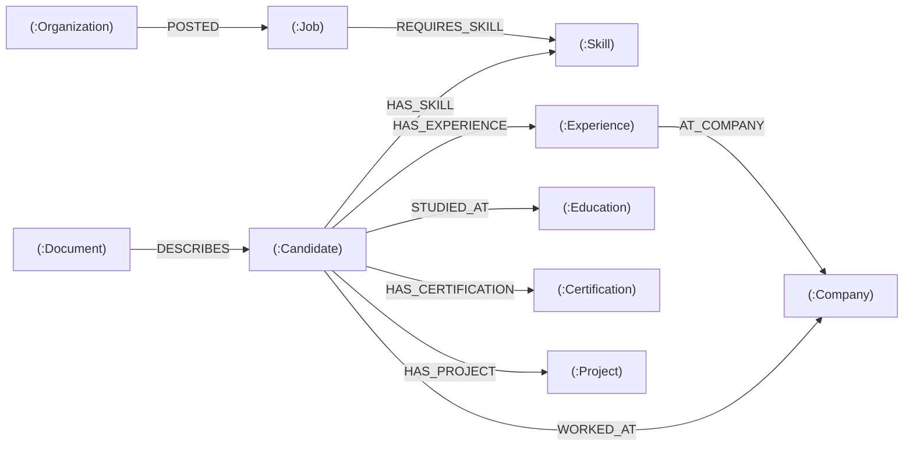

> **Why a graph?** Candidate↔Job relevance can be reasoned as a path: a candidate and a job that
> share `:Skill` nodes (`Candidate-[:HAS_SKILL]->Skill<-[:REQUIRES_SKILL]-Job`) score higher;
> `WORKED_AT` / `AT_COMPANY` enable company-overlap signals. This `graph_score` feeds
> `candidate_job_matches`.

---

# 3. Qdrant — Vector schema

Qdrant stores embeddings produced by **Ollama `nomic-embed-text`** (768-dim, **cosine** distance).
PATHS follows a **one-vector-per-entity** rule for the unified collections, plus **chunked**
collections for RAG. Point IDs equal the relational UUID (or `uuid:chunk_index` for chunks).

| Collection | Granularity | Dim / Distance | Point id | Source | Purpose |
|-----------|-------------|----------------|----------|--------|---------|
| `paths_candidates` | one per candidate | 768 / Cosine | `candidate_id` | `candidates` (+CV) | candidate ↔ job semantic similarity, semantic search |
| `paths_jobs` | one per job | 768 / Cosine | `job_id` | `jobs` | job ↔ candidate similarity, "top matches" |
| `candidate_cv_chunks` | many per candidate | 768 / Cosine | `cand:chunk` | CV text chunks | CV evidence / skill-evidence RAG (legacy chunked) |
| `job_description_chunks` | many per job | 768 / Cosine | `job:chunk` | JD text chunks | JD analysis RAG |
| `company_knowledge` | many per file | 768 / Cosine | `file:chunk` | `company_knowledge_files` | org-scoped policy/compliance RAG (interview prep, decisions) |

### 3.1 Payload schemas

**`paths_candidates`** (one vector per candidate)
```json
{
  "entity_type": "candidate",
  "candidate_id": "uuid",
  "current_title": "str",
  "skills": ["str"],
  "years_of_experience": 0,
  "location": "str",
  "open_to_work": true,
  "status": "active",
  "source": "str",
  "source_hash": "str",
  "embedding_model": "nomic-embed-text",
  "embedding_version": "v1",
  "vector_dimension": 768,
  "updated_at": "iso8601"
}
```

**`paths_jobs`** (one vector per job)
```json
{
  "entity_type": "job",
  "job_id": "uuid",
  "organization_id": "uuid",
  "company_id": "uuid",
  "title": "str",
  "skills": ["str"],
  "seniority_level": "str",
  "employment_type": "str",
  "work_mode": "remote|hybrid|onsite",
  "status": "str",
  "source": "str",
  "source_hash": "str",
  "embedding_model": "nomic-embed-text",
  "embedding_version": "v1",
  "vector_dimension": 768,
  "updated_at": "iso8601"
}
```

**`company_knowledge`** (chunked RAG)
```json
{
  "organization_id": "uuid",
  "file_id": "uuid",
  "file_name": "str",
  "category": "str",
  "is_legal_or_compliance_context": true,
  "chunk_index": 0,
  "text": "str",
  "source": "str"
}
```

`candidate_cv_chunks` / `job_description_chunks` carry the chunk `text`, owning entity id, and
`chunk_index` (a `stage` marker is also stored on CV chunks during ingestion).

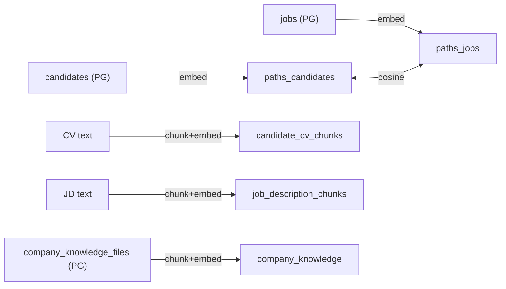

---

# 4. Cross-store synchronization

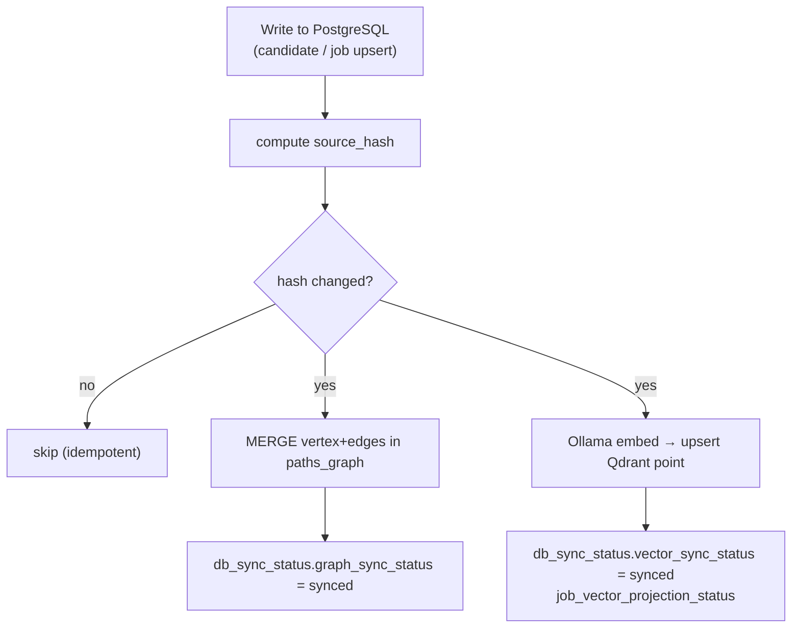

- **`db_sync_status`** — per entity (`candidate` / `job`): `graph_sync_status`, `vector_sync_status`,
  last-synced timestamps, `retry_count`, and `source_hash` for idempotent re-sync.
- **`job_vector_projection_status`** — per job: which `collection_name` / `point_id` / `embedding_model`
  the job vector lives at, and `projection_status`.
- **`jobs.graph_sync_status` / `jobs.vector_sync_status`** and `last_graph_sync_at` / `last_vector_sync_at`
  mirror sync state on the row itself for quick reads.

---

# 5. Master foreign-key reference

Every relational FK edge (child.column → parent table):

```text
anonymized_views.candidate_id                         → candidates
applications.candidate_id                             → candidates
applications.job_id                                   → jobs
assessments.application_id                            → applications
assessments.candidate_id                              → candidates
assessments.job_id                                    → jobs
audit_logs.actor_user_id                              → users
bias_flags.org_id                                     → organizations
bias_reports.job_id                                   → jobs
bias_reports.screening_run_id                         → screening_runs
candidate_certifications.candidate_id                 → candidates
candidate_contacts.candidate_id                       → candidates
candidate_documents.candidate_id                      → candidates
candidate_duplicates.candidate_id_a / _b              → candidates
candidate_duplicates.merged_into_candidate_id         → candidates
candidate_duplicates.organization_id                  → organizations
candidate_duplicates.reviewed_by                      → users
candidate_education.candidate_id                      → candidates
candidate_experiences.candidate_id                    → candidates
candidate_job_matches.application_id                  → applications
candidate_job_matches.candidate_id / job_id           → candidates / jobs
candidate_job_scores.candidate_id / job_id            → candidates / jobs
candidate_links.candidate_id                          → candidates
candidate_merge_audit.canonical_candidate_id          → candidates
candidate_merge_audit.organization_id                 → organizations
candidate_merge_audit.performed_by_user_id            → users
candidate_pool_members.candidate_id                   → candidates
candidate_pool_members.pool_run_id                    → candidate_pool_runs
candidate_pool_runs.config_id                         → job_candidate_pool_configs
candidate_pool_runs.created_by_user_id                → users
candidate_pool_runs.job_id / organization_id          → jobs / organizations
candidate_projects.candidate_id                       → candidates
candidate_skills.candidate_id / skill_id              → candidates / skills
candidate_sources.candidate_id                        → candidates
candidates.merged_into_candidate_id                   → candidates (self)
candidates.owner_organization_id                      → organizations
candidates.user_id                                    → users
company_knowledge_files.organization_id               → organizations
company_knowledge_files.uploaded_by_user_id           → users
de_anon_events.approval_id                            → hitl_approvals
de_anon_events.approver_user_id / requested_by_user_id→ users
de_anon_events.candidate_id / org_id                  → candidates / organizations
decision_emails.application_id                        → applications
decision_emails.approved_by_user_id                   → users
decision_emails.candidate_id / job_id / organization_id→ candidates / jobs / organizations
decision_emails.decision_packet_id                    → decision_support_packets
decision_score_breakdowns.decision_packet_id          → decision_support_packets
decision_support_packets.application_id               → applications
decision_support_packets.candidate_id / job_id / organization_id → candidates / jobs / organizations
development_plans.application_id                       → applications
development_plans.candidate_id / job_id / organization_id → candidates / jobs / organizations
development_plans.decision_packet_id                  → decision_support_packets
enriched_contacts.approved_by                         → users
enriched_contacts.candidate_id                        → candidates
evidence_items.candidate_id                           → candidates
external_candidate_batches.organization_id            → organizations
external_candidate_batches.requested_by_user_id       → users
external_candidates.batch_id                          → external_candidate_batches
external_candidates.imported_candidate_id             → candidates
external_candidates.organization_id                   → organizations
fairness_rubric.job_id                                → jobs
feature_flag_overrides.flag_id                        → feature_flags
google_integrations.user_id                           → users
hitl_approvals.organization_id                        → organizations
hitl_approvals.requested_by_user_id / reviewed_by_user_id → users
hr_final_decisions.application_id                     → applications
hr_final_decisions.candidate_id / job_id / organization_id → candidates / jobs / organizations
hr_final_decisions.decided_by_user_id                 → users
hr_final_decisions.decision_packet_id                 → decision_support_packets
ingestion_errors.source_run_id                        → job_source_runs
interview_bookings.candidate_id                       → candidates
interview_bookings.hr_user_id                         → users
interview_bookings.job_id                             → jobs
interview_bookings.outreach_session_id                → outreach_sessions
interview_decision_packets.application_id             → applications
interview_decision_packets.candidate_id / job_id      → candidates / jobs
interview_decision_packets.interview_id               → interviews
interview_evaluations.interview_id                    → interviews
interview_human_decisions.decided_by                  → users
interview_human_decisions.interview_id                → interviews
interview_participants.interview_id                   → interviews
interview_participants.user_id                        → users
interview_question_packs.interview_id                 → interviews
interview_summaries.interview_id                      → interviews
interview_transcripts.interview_id                    → interviews
interviews.application_id                             → applications
interviews.candidate_id / job_id / organization_id    → candidates / jobs / organizations
interviews.created_by_user_id                         → users
invoices.subscription_id                              → subscriptions
job_candidate_pool_configs.created_by_user_id         → users
job_candidate_pool_configs.job_id / organization_id   → jobs / organizations
job_import_errors.import_run_id                       → job_import_runs
job_raw_items.source_run_id                           → job_source_runs
job_requirements.job_id                               → jobs
job_responsibilities.job_id                           → jobs
job_skill_requirements.job_id                         → jobs
job_skills.job_id / skill_id                          → jobs / skills
job_vector_projection_status.job_id                   → jobs
jobs.company_id                                       → companies
jobs.created_by_user_id                               → users
jobs.organization_id                                  → organizations
merge_history.kept_candidate_id / removed_candidate_id→ candidates
merge_history.merged_by                               → users
merge_history.organization_id                         → organizations
organization_access_requests.organization_id          → organizations
organization_access_requests.requester_user_id / reviewed_by_admin_id → users
organization_blind_candidate_maps.candidate_id        → candidates
organization_blind_candidate_maps.matching_run_id     → organization_matching_runs
organization_candidate_import_errors.import_id        → organization_candidate_imports
organization_candidate_import_errors.matching_run_id  → organization_matching_runs
organization_candidate_imports.matching_run_id        → organization_matching_runs
organization_candidate_rankings.candidate_id / job_id → candidates / jobs
organization_candidate_rankings.job_request_id        → organization_job_requests
organization_candidate_rankings.matching_run_id       → organization_matching_runs
organization_candidate_source_settings.organization_id→ organizations
organization_candidate_source_settings.updated_by_user_id → users
organization_job_requests.job_id                      → jobs
organization_matching_runs.job_id                     → jobs
organization_matching_runs.job_request_id             → organization_job_requests
organization_members.organization_id / user_id        → organizations / users
organization_outreach_messages.candidate_id / job_id  → candidates / jobs
organization_outreach_messages.matching_run_id        → organization_matching_runs
organization_outreach_messages.ranking_id             → organization_candidate_rankings
organizations.approved_by_admin_id / rejected_by_admin_id / linkedin_connected_by_user_id → users
outreach_availability_windows.outreach_session_id     → outreach_sessions
outreach_sessions.candidate_id / job_id / organization_id → candidates / jobs / organizations
outreach_sessions.hr_user_id                          → users
scoring_errors.scoring_run_id                         → scoring_runs
scoring_runs.candidate_id                             → candidates
screening_results.candidate_id / job_id               → candidates / jobs
screening_results.screening_run_id                    → screening_runs
screening_runs.job_id                                 → jobs
subscriptions.plan_id                                 → plans
```

---

*Generated from live SQLAlchemy metadata (100 tables), the Apache AGE graph repositories
(`graph_repo`, `candidates_graph`, `jobs_graph`), and the Qdrant collection configuration
(`app/core/config.py`, `candidate_sync_service`, `job_sync_service`, `company_knowledge`).*
