# Find Talent (Talent Finding) — Workflow

The **Candidates → Find Talent** tab sources outbound candidates live from
LinkedIn (via the LinkedIn MCP server), optionally folds in the org's own
database candidates via semantic (vector) search, then an agent ranks the
whole pool against the target job — **Open-to-Work first**.

- **UI:** `components/outreach/find-talent-panel.tsx`
- **API:** `POST /api/v1/recruiter/source-candidate/find-talent` (`api/v1/source_candidate.py`)
- **Agent / ranking:** `services/source_candidate/find_talent_ranker.py`
- **LinkedIn MCP client:** `services/source_candidate/providers/linkedin_mcp_provider.py`
- **Vector search:** `services/matching_workspace/semantic.py` (Qdrant, 768-d nomic-embed)

```mermaid
flowchart TD
    %% ── Frontend ──
    subgraph UI["Find Talent panel — Candidates &rarr; Find Talent"]
        A["Recruiter fills the form:<br/>- requirements brief (&le;6000 chars)<br/>- source: LinkedIn | All sources<br/>- target job to rank against<br/>- location, count (1-10)<br/>- Verify 'Open to work' toggle"] --> B["Click Search<br/>useFindTalent mutation"]
    end

    B -->|"POST /recruiter/source-candidate/find-talent"| GATE

    %% ── Backend route ──
    subgraph API["Backend - find_talent route"]
        GATE{"Auth gate:<br/>active org + hiring role?"}
        GATE -->|no| ERR401["401 / 403"]
        GATE -->|yes| DISTILL["1 - Distill search query<br/>distill_search_query()"]
    end

    DISTILL -->|"short brief -> use as-is"| FETCH
    DISTILL -->|"long brief -> LLM"| LLM1["OpenRouter LLM<br/>2-6 keyword query<br/>fallback: job title / keywords"]
    LLM1 --> FETCH

    %% ── LinkedIn sourcing ──
    FETCH["2 - service.fetch_batch(linkedin_mcp)"] --> MCP1
    subgraph MCPSRV["LinkedIn MCP server :8080"]
        MCP1["MCP handshake:<br/>initialize -> initialized -><br/>tools/call search_people"]
    end
    MCP1 -->|"people results"| PARSE["Parse profiles ->><br/>persist ExternalCandidate rows<br/>+ ExternalCandidateBatch"]
    MCP1 -.->|"MCP down / no URL"| FB["CSV export fallback<br/>or provider_available=false"]

    PARSE --> VERIFY{"3 - Verify Open-to-Work?<br/>(toggle on)"}
    VERIFY -->|yes| VLOOP["Per candidate, concurrency=3:<br/>get_person_profile via MCP ->><br/>OTW badge + top skills + about"]
    VLOOP --> POOL
    VERIFY -->|no| POOL

    %% ── DB semantic search ──
    POOL["Build candidate pool<br/>(source = linkedin)"] --> SRC{"source == 'all'?"}
    SRC -->|yes| SEM["4 - semantic_search()<br/>Qdrant vector search (768-d)<br/>-> DB Candidate rows"]
    SEM --> MERGE["Merge into pool<br/>(source = database, dedup)"]
    SRC -->|no| MERGE

    MERGE --> EMPTY{"pool empty?"}
    EMPTY -->|yes| RET0["Return empty + message"]
    EMPTY -->|no| RANK["5 - rank_candidates()"]

    %% ── Ranking agent ──
    RANK --> RLLM{"OpenRouter available?"}
    RLLM -->|yes| RANKLLM["LLM batched ranking:<br/>score 0-100, why-match,<br/>matched/missing skills"]
    RLLM -->|"no / error"| RANKDET["Deterministic fallback:<br/>keyword + skill overlap"]
    RANKLLM --> SORT
    RANKDET --> SORT

    SORT["6 - Sort: Open-to-Work first,<br/>then score desc -> renumber ranks"] --> RESP["Return FindTalentResponse<br/>batch_id + results[]"]

    RESP --> CARDS["Ranked candidate cards:<br/>score, OTW badge, source,<br/>why-match, skills, View on LinkedIn"]

    %% ── Import sub-flow ──
    CARDS -->|"Click 'Import to database'"| IMP["POST /external/{id}/import<br/>service.import_candidate()"]
    IMP --> DEDUP{"duplicate?"}
    DEDUP -->|no| CREATE["Create Candidate<br/>(+ CandidateSource, maybe account)"]
    DEDUP -->|yes| DUP["status: duplicate /<br/>already_imported"]
    CREATE --> DONE["Card shows 'Imported' -> View profile"]
    DUP --> DONE
```

## Step-by-step

1. **Distill the query** — a long requirements brief is reduced to a 2–6 word
   LinkedIn people-search phrase (OpenRouter LLM; short briefs are used as-is;
   deterministic fallback to job title / salient keywords).
2. **Source from LinkedIn** — `fetch_batch` drives the LinkedIn MCP server
   (`initialize → notifications/initialized → tools/call search_people` over
   Streamable-HTTP), parses each person, and persists `ExternalCandidate` +
   `ExternalCandidateBatch`. If the MCP URL is unset/unreachable it falls back
   to consented CSV exports or reports the provider unavailable.
3. **Verify Open-to-Work** (optional toggle) — reads each profile via
   `get_person_profile` (bounded concurrency = 3) to confirm the public
   Open-to-Work badge and pull real "Top skills".
4. **Database candidates** (source = "All sources") — semantic/vector search
   over Qdrant returns the org's own candidates and merges them into the pool.
5. **Rank** — one batched OpenRouter call scores every candidate 0–100 with a
   "why this match" + matched/missing skills (deterministic keyword/skill
   overlap fallback when the LLM is unavailable).
6. **Sort & return** — verified Open-to-Work candidates first, then by fit
   score; ranks are renumbered and returned to the panel as cards.
7. **Import** (per card) — "Import to database" creates a real `Candidate`
   (with dedup) so the sourced person enters your pipeline.
