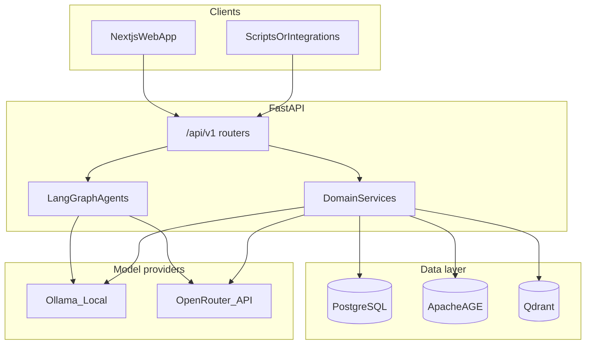

# PATHS — Project walkthrough

This document explains what **PATHS** is, how the repository is organized, how the main pieces fit together, and **what is implemented today** (backend APIs, database migrations, and frontend routes). For deep setup (Docker, Ollama models, scoring env vars, curl examples), use **[backend/README.md](backend/README.md)** as the authoritative backend guide.

---

## Executive summary

**PATHS** is a hiring workflow platform that combines:

- **CV intelligence** — Upload and parse résumés (PDF/DOCX/TXT), extract structured candidate data, and sync it across relational, graph, and vector stores.
- **Job intelligence** — Ingest job postings, requirements, and vectors so roles can be matched to candidates.
- **Matching and scoring** — Combine LLM-based judgment (e.g. OpenRouter) with vector similarity (Qdrant), with persistence and audit-friendly artifacts.
- **Organization workflows** — Discovery, blind/anonymized ranking, outreach drafts, and related services (see backend organization matching package).
- **Interview and decision support** — Models and APIs for interviews, summaries, evaluations, and decision packets downstream of screening.
- **Governance-oriented surfaces** — Audit, bias/fairness, evidence items, and human-in-the-loop approvals where the schema and routers support them.

The codebase is a **monorepo**: a **FastAPI** backend under `backend/` and a **Next.js** (App Router) web app under `frontend/apps/web/`, coordinated by a pnpm workspace under `frontend/`.

---

## Repository layout

| Area | Path | Role |
|------|------|------|
| Backend API & workers | [backend/](backend/) | FastAPI app entry [backend/app/main.py](backend/app/main.py), Alembic migrations [backend/alembic/](backend/alembic/), SQLAlchemy models [backend/app/db/models/](backend/app/db/models/), LangGraph-style agents [backend/app/agents/](backend/app/agents/), domain services [backend/app/services/](backend/app/services/), HTTP routers [backend/app/api/v1/](backend/app/api/v1/) |
| Frontend workspace | [frontend/](frontend/) | [frontend/pnpm-workspace.yaml](frontend/pnpm-workspace.yaml) defines `apps/*` and `packages/*` |
| Primary web UI | [frontend/apps/web/](frontend/apps/web/) | Next.js 16, React 19 — marketing, auth, candidate flows, recruiter dashboard |

Key indexes:

- **All persisted entity types (Python)** — [backend/app/db/models/__init__.py](backend/app/db/models/__init__.py)
- **Registered HTTP API surface** — router includes in [backend/app/main.py](backend/app/main.py)

---

## High-level architecture

**Store roles** (aligned with [backend/README.md](backend/README.md)):

| Store | Purpose |
|-------|---------|
| **PostgreSQL** | Canonical relational data: candidates, jobs, applications, scores, interviews, org matching, audit, etc. |
| **Apache AGE** | Graph projections (e.g. candidate–skill–job style relationships) for querying and enrichment |
| **Qdrant** | Vector embeddings for semantic search and scoring similarity |

**Typical CV ingestion path** (conceptual): document upload → extract text → structured extraction (Ollama + deterministic steps) → normalize → **PostgreSQL** → project to **AGE** → chunk → embed (Ollama) → **Qdrant** → finalize job. Shared **UUIDs** (e.g. `candidate_id`) tie stores together.

---

## Backend: what exists today

Routers are mounted from [backend/app/main.py](backend/app/main.py) under `/api/v1` (unless noted). Grouped by theme:

| Theme | Router module (under `app/api/v1/`) | Typical concerns |
|-------|-------------------------------------|-------------------|
| Health & diagnostics | `health`, `system` | DB and dependency checks |
| Identity & tenancy | `auth`, `organizations` | Sessions/org context |
| Candidates & documents | `candidates`, `cv_ingestion` | Profiles and CV pipeline triggers |
| Jobs | `job_ingestion`, `job_import`, `jobs` | Posting intake, import/scraper hooks, recruiter job APIs |
| Admin & operations | `admin` | Operational endpoints |
| Matching & ranking | `scoring`, `organization_matching` | Candidate–job scores; org discovery, ranking, outreach |
| Interview & decisions | `interviews`, `decision_support` | Interview lifecycle and decision artifacts |
| Applications workflow | `applications`, `approvals` | Application flow and HITL-style approvals |
| Insights & compliance | `dashboard`, `audit`, `bias_fairness`, `evidence` | Aggregates, audit trail, fairness metrics, evidence items |

**Scheduler:** On startup, the app attempts to start an **hourly job-scraper scheduler** when enabled via configuration (`JOB_SCRAPER_ENABLED` — see lifespan in [backend/app/main.py](backend/app/main.py)).

For **scoring** formulas, env vars, and example `curl` calls, see the dedicated section in [backend/README.md](backend/README.md).

---

## Database evolution — what is done so far

Alembic migrations live in [backend/alembic/versions/](backend/alembic/versions/). The chain below is the **upgrade order** from base to head (each line is one revision file / theme).

| Order | Revision (id) | Migration file (representative) | Intent |
|------:|---------------|----------------------------------|--------|
| 1 | `a7077cc7ae66` | [a7077cc7ae66_initial_schema.py](backend/alembic/versions/a7077cc7ae66_initial_schema.py) | Initial relational schema (core entities and audit-style events) |
| 2 | `b8188dd8bf77` | [b8188dd8bf77_add_cv_ingestion_tables.py](backend/alembic/versions/b8188dd8bf77_add_cv_ingestion_tables.py) | CV ingestion–related tables |
| 3 | `42430ef650e8` | [42430ef650e8_add_auth_schema.py](backend/alembic/versions/42430ef650e8_add_auth_schema.py) | Authentication schema |
| 4 | `c01234567890` | [c01234567890_add_job_ingestion_tables.py](backend/alembic/versions/c01234567890_add_job_ingestion_tables.py) | Job ingestion tables |
| 5 | `80a2c3cb4e2f` | [80a2c3cb4e2f_add_requirements_and_experience_level_.py](backend/alembic/versions/80a2c3cb4e2f_add_requirements_and_experience_level_.py) | Job requirements and experience level fields |
| 6 | `d10001abcdef` | [d10001abcdef_unified_db_integration.py](backend/alembic/versions/d10001abcdef_unified_db_integration.py) | Unified integration (cross-store alignment) |
| 7 | `d20002cdef012` | [d20002cdef012_job_scraper_import_tables.py](backend/alembic/versions/d20002cdef012_job_scraper_import_tables.py) | Job scraper / import tables |
| 8 | `d30003abcdef` | [d30003abcdef_candidate_job_scoring.py](backend/alembic/versions/d30003abcdef_candidate_job_scoring.py) | Candidate–job scoring tables |
| 9 | `d40004fedcba` | [d40004fedcba_organization_matching_tables.py](backend/alembic/versions/d40004fedcba_organization_matching_tables.py) | Organization-side matching, imports, outreach, blind maps, rankings |
| 10 | `e50005intintel` | [e50005_interview_intelligence_tables.py](backend/alembic/versions/e50005_interview_intelligence_tables.py) | Interview intelligence (interviews, transcripts, summaries, evaluations, decision packets, human decisions) |
| 11 | `f60006dss` | [f60006_decision_support_system_tables.py](backend/alembic/versions/f60006_decision_support_system_tables.py) | Decision support (packets, score breakdowns, HR decisions, development plans, decision emails) |
| 12 | `g70007candprof` | [g70007_candidate_profile_fields.py](backend/alembic/versions/g70007_candidate_profile_fields.py) | Additional candidate profile fields |
| 13 | `e50005abcdef` | [e50005abcdef_add_hitl_approvals_table.py](backend/alembic/versions/e50005abcdef_add_hitl_approvals_table.py) | Human-in-the-loop approvals table |
| 14 | `h80008biasfair` | [h80008_bias_fairness_tables.py](backend/alembic/versions/h80008_bias_fairness_tables.py) | Bias and fairness–related persistence |
| 15 | `i90009evidence` | [i90009_evidence_items.py](backend/alembic/versions/i90009_evidence_items.py) | Evidence items |

**Model index:** After `alembic upgrade head`, the SQLAlchemy surface area exported from [backend/app/db/models/__init__.py](backend/app/db/models/__init__.py) is the best single checklist of **tables/entities** the ORM knows about (organizations, users, candidates, jobs, applications, ingestion, CV entities, job ingestion/scraper, scoring, org matching, interviews, decision support, sync/audit/matches, evidence, etc.).

---

## Frontend: user-facing walkthrough

The main app is [frontend/apps/web/](frontend/apps/web/). Routes use the **Next.js App Router** under `src/app/`.

### Marketing (`src/app/(marketing)/`)

Public marketing pages, including:

- `how-it-works`, `for-candidates`, `for-companies`, `careers`

### Auth (`src/app/(auth)/`)

- `login`
- `candidate-signup`

### Candidate journey

- **Onboarding** — `src/app/onboarding/` (e.g. basic info, education, experience, skills, CV upload, contact, links, preferences, review)
- **Candidate app** — `src/app/candidate/` (dashboard, profile and edit, documents, applications)

### Recruiter / organization dashboard (`src/app/(dashboard)/`)

The [frontend/apps/web/src/app/(dashboard)/layout.tsx](frontend/apps/web/src/app/(dashboard)/layout.tsx) layout guards the shell: it redirects unauthenticated users to `/login` and wraps content in the shared **Shell** layout.

Typical dashboard routes:

| Route area | Purpose |
|------------|---------|
| `dashboard` | Org home / metrics |
| `jobs`, `jobs/[id]/screening` | Job list and per-job screening |
| `candidates`, `candidates/[id]`, `candidates/[id]/decision` | Pipeline and decision views |
| `interviews`, `interviews/[id]` | Interview list and detail |
| `outreach` | Outreach workflows |
| `approvals` | Approval queue |
| `audit` | Audit browsing |
| `settings/organization`, `settings/members` | Org and membership settings |

---

## How to run locally (pointers)

1. **Infrastructure** — From `backend/`, use Docker Compose as described in [backend/README.md](backend/README.md) (PostgreSQL, Qdrant, Ollama; plus AGE setup on Postgres).
2. **Environment** — Copy [backend/.env.example](backend/.env.example) to `backend/.env` and adjust hosts for local vs Docker networking.
3. **Backend dependencies** — `pip install -r backend/requirements.txt` (from `backend/`).
4. **Migrations** — `alembic upgrade head` from `backend/` with the correct `DATABASE_URL` / Alembic env.
5. **API server** — e.g. `uvicorn app.main:app --host 0.0.0.0 --port 8000 --reload` from `backend/`.
6. **Frontend** — From `frontend/apps/web/`, install workspace deps per your usual pnpm workflow, then `pnpm dev` (see [frontend/apps/web/package.json](frontend/apps/web/package.json)).

Ollama model pulls, AGE graph creation, and **scoring / OpenRouter** variables are documented in [backend/README.md](backend/README.md); this walkthrough does not duplicate those long sections.

---

## Out of scope for this document

- **Production deployment** (hosting, TLS, secrets rotation, scaling) — not specified here.
- **Exact SLAs or quotas** for third-party APIs (e.g. OpenRouter) — refer to vendor docs.
- **Line-by-line API reference** — use FastAPI’s auto-generated OpenAPI docs at `/docs` when the server is running, plus the router modules under [backend/app/api/v1/](backend/app/api/v1/).

---

## Related files quick reference

| Topic | Location |
|-------|----------|
| FastAPI app & router registration | [backend/app/main.py](backend/app/main.py) |
| SQLAlchemy models (package exports) | [backend/app/db/models/__init__.py](backend/app/db/models/__init__.py) |
| Migrations | [backend/alembic/versions/](backend/alembic/versions/) |
| CV pipeline & infra | [backend/README.md](backend/README.md) |
| Org matching services overview | [backend/app/services/organization_matching/__init__.py](backend/app/services/organization_matching/__init__.py) |
| Dashboard auth gate | [frontend/apps/web/src/app/(dashboard)/layout.tsx](frontend/apps/web/src/app/(dashboard)/layout.tsx) |
