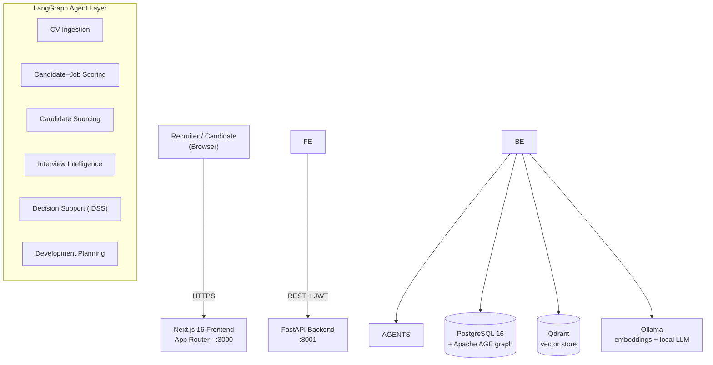

<div align="center">
PATHS — Personalised AI Talent Hiring System

Evidence-driven, human-in-the-loop recruitment powered by agentic AI.


</div>
---
Overview
PATHS is a full-stack platform that supports the entire hiring lifecycle —
from sourcing and CV screening through interviewing to a final, auditable hiring
decision and a personalised development plan. Rather than replacing recruiters,
it acts as a team of specialised LangGraph agents that gather evidence, score
candidates against each role, and surface transparent, explainable
recommendations — while a human remains the decision-maker at every gate.
The system was built as a graduation project to explore how agentic AI and a
combined graph + vector data model can make recruitment faster, fairer, and
more transparent:
Evidence-driven — every score is backed by traceable evidence (CV, GitHub,
interview transcript) and a weighted rubric, not a black box.
Human-in-the-loop — agents recommend; recruiters and hiring managers decide.
Sensitive actions (de-anonymisation, outreach, final decisions) require explicit
human approval.
Explainable — the Intelligent Decision Support System (IDSS) breaks each
candidate's score down per pipeline stage with a written justification.
Private by default — all AI inference (embeddings + LLM) runs locally via
Ollama; no external AI API key is required.
---
Key features
Area	What it does
Sourcing	Find candidates from an internal pool or external connectors (incl. an MCP-based LinkedIn provider) and score them against a specific job.
CV screening	Ingests CVs, extracts skills / experience / education, and embeds them for semantic matching.
Candidate–job scoring	Blends an LLM skill-fit assessment with vector similarity into a single, weighted match score.
Interview intelligence	Generates a candidate pre-analysis plus tailored technical and HR / behavioural question drafts, then analyses the transcript and scores by interview type.
Decision support (IDSS)	Weighted, per-stage rubric with AI explainability and a human-feedback override; produces a recommendation, confidence, and the next step.
Development planning	On a hire/reject decision, an agent drafts an 18-month (accept) or 12-month (reject) growth plan.
Fairness & anonymisation	Candidate identity is hidden from the scoring/interview agents; protected attributes are never used.
Platform admin tooling	A control plane for organisations, users, agent runs, feature flags, system health, and a live Knowledge Graph & Vector DB inspector.
Auditability	PDF decision reports with per-stage breakdowns; rejected candidates stay in the database (never silently deleted).
The hiring pipeline runs through configurable stages:
Define → Source → Screen → Interview → Decision → Development.
---
User roles
Role	Capabilities
Candidate	Register, complete a profile / upload a CV, discover jobs, view applications and a personalised development plan.
Recruiter / HR	Create jobs, source and screen candidates, run matching, prepare interviews, manage outreach.
Hiring Manager	Review the decision packet and make the final hire/reject decision.
Organization Admin	Manage the organisation, members, knowledge base, and approve sensitive actions (e.g. de-anonymisation).
Platform Admin	Operate the platform: organisations, users, analytics, agent monitoring, feature flags, and the Graph & Vector DB inspector.
---
System architecture

Layer	Technology
Frontend	Next.js 16 (App Router) · React 19 · Tailwind v4 · TanStack Query · Zustand
Backend	FastAPI · SQLAlchemy · Alembic · Pydantic v2
Relational + graph	PostgreSQL 16 + Apache AGE (graph `paths\_graph`)
Vector store	Qdrant (candidate + job embeddings, 768-dim, cosine)
Agents	LangGraph (CV ingestion, sourcing, scoring, interview, decision support, development)
AI models	Ollama — `nomic-embed-text` (embeddings) + `llama3.1:8b` (local LLM)
Auth	JWT (argon2id password hashing)
---
Quick start
Prerequisites
Docker + Docker Compose (the only requirement for Option A)
For local development also: Python 3.11+, Node.js 20+, pnpm 9+
Option A — Run everything with Docker (recommended)
One command builds the images and starts the whole stack (Postgres + AGE,
Qdrant, Ollama, backend, and frontend). The backend applies its database
migrations automatically on startup, and Apache AGE is initialised on first
boot.
```bash
git clone <your-repo-url> paths \&\& cd paths
docker compose up -d --build
```
Then open:
Service	URL
Web app	http://localhost:3000
API docs (Swagger)	http://localhost:8001/docs
Optional follow-ups:
```bash
# Load a demo dataset (orgs, jobs, candidates, a full pipeline)
docker compose exec backend python -m seed.demo

# Pull the local AI models for full embedding / LLM features
docker compose exec ollama ollama pull nomic-embed-text
docker compose exec ollama ollama pull llama3.1:8b
```
> Copy `.env.example` to `.env` first if you want to override defaults
> (e.g. `SECRET\_KEY`). The stack runs with sensible defaults out of the box —
> and because all AI inference is local via Ollama, \*\*no external API key is
> needed\*\*.
To stop: `docker compose down` (add `-v` to also delete the data volumes).
Option B — Local development
Start just the infrastructure in Docker, then run the apps on your host with
hot-reload:
```bash
# 1. Infrastructure (Postgres + AGE, Qdrant, Ollama)
docker compose -f backend/docker-compose.yml up -d

# 2. Backend (http://localhost:8001)
cd backend
python -m venv .venv \&\& source .venv/bin/activate     # Windows: .venv\\Scripts\\activate
pip install -r requirements.txt
cp .env.example .env                                   # defaults target localhost
alembic upgrade head
uvicorn app.main:app --reload --port 8001

# 3. Frontend (http://localhost:3000) — in a second terminal
cd frontend
pnpm install
cp .env.local.example apps/web/.env.local              # sets NEXT\_PUBLIC\_API\_URL
pnpm --filter @paths/web dev

# 4. (optional) demo data + local models
cd backend \&\& python -m seed.demo
ollama pull nomic-embed-text \&\& ollama pull llama3.1:8b
```
---
Configuration
All backend settings are environment variables (see `backend/.env.example`
for the full, documented list). The frontend reads
`frontend/.env.local.example`. The essentials:
Variable	Service	Description
`SECRET\_KEY`	backend	32+ char random string for JWT signing (change for any non-local use).
`DATABASE\_URL`	backend	PostgreSQL connection string.
`QDRANT\_URL`	backend	Qdrant server URL.
`OLLAMA\_BASE\_URL`	backend	Ollama server URL — powers both embeddings and the local LLM.
`NEXT\_PUBLIC\_API\_URL`	frontend	Backend base URL, baked into the browser bundle at build time.
With `docker compose`, the service-to-service URLs are wired automatically;
you only need an `.env` to override the defaults documented in `.env.example`.
---
Project structure
```text
paths/
├── docker-compose.yml          Full-stack orchestration (infra + backend + web)
├── .env.example                Root compose overrides
├── backend/                    FastAPI service
│   ├── app/
│   │   ├── api/v1/             Route handlers
│   │   ├── agents/             LangGraph agents
│   │   ├── services/           Business logic (scoring, decision support, …)
│   │   ├── db/models/          SQLAlchemy ORM models
│   │   ├── core/               Config, security, database
│   │   └── main.py             Application entry point
│   ├── alembic/                Database migrations
│   ├── seed/                   Demo-data generator (`python -m seed.demo`)
│   ├── Dockerfile              Auto-migrates, then serves
│   └── docker-compose.yml      Infrastructure only (for local dev)
├── frontend/                   pnpm workspace
│   └── apps/web/               Next.js application
│       ├── public/             Static assets (incl. paths-logo.png)
│       ├── src/app/            Route groups + pages
│       ├── src/components/     UI + feature components
│       └── src/lib/            API client + React Query hooks
├── docs/                       Architecture, implementation, evaluation, testing
└── scripts/                    Smoke test (scripts/smoke.js)
```
---
Documentation
In-depth write-ups live in `docs/`:
Document	Contents
Chapter_4_Implementation.md	Tools/libraries, environment, system architecture, AI/RAG/graph/vector implementation.
Recommender_System.md	The hybrid candidate–job recommender (vector + LLM + graph), scoring formula and bands.
MCP_Implementation.md	Model Context Protocol client (LinkedIn sourcing) and skill-evidence tools.
Implementation_Challenges.md	Real engineering challenges and how they were solved.
TEST.md	Testing strategy and results (pytest + Playwright E2E across all roles).
PATHS_Evaluation_Results.md	Controlled evaluation (20-candidate AI-Engineer scenario): precision, ranking, fairness.
---
Deployment
The repository is deployment-ready via the root `docker-compose.yml`:
Provision a host with Docker, clone the repo, and create a `.env`
(start from `.env.example`). Set a strong `SECRET\_KEY` and, for the
production guard, `APP\_ENV=production`.
`docker compose up -d --build` — migrations run automatically on first boot,
and Apache AGE is initialised via `backend/scripts/init\_age.sql`.
Put a reverse proxy (e.g. Caddy / Nginx) in front to terminate TLS and route
`:3000` (web) and `:8001` (API).
Pull the Ollama models once (`nomic-embed-text`, `llama3.1:8b`) so embedding
and LLM features are available.
The frontend image builds Next.js in standalone mode and bakes
`NEXT\_PUBLIC\_API\_URL` at build time, so point it at your public API URL via the
`web.build.args` / `NEXT\_PUBLIC\_API\_URL` variable before building.
---
Testing
```bash
# Backend — unit \& integration tests
cd backend \&\& pytest

# Frontend — type-check
cd frontend \&\& pnpm --filter @paths/web exec tsc --noEmit

# End-to-end (Playwright, all personas) — requires the stack running
cd e2e \&\& npx playwright test
```
---
License
This project is proprietary and all rights are reserved.
You may not copy, use, modify, distribute, or reuse any part of this repository
without written permission from the owner.
