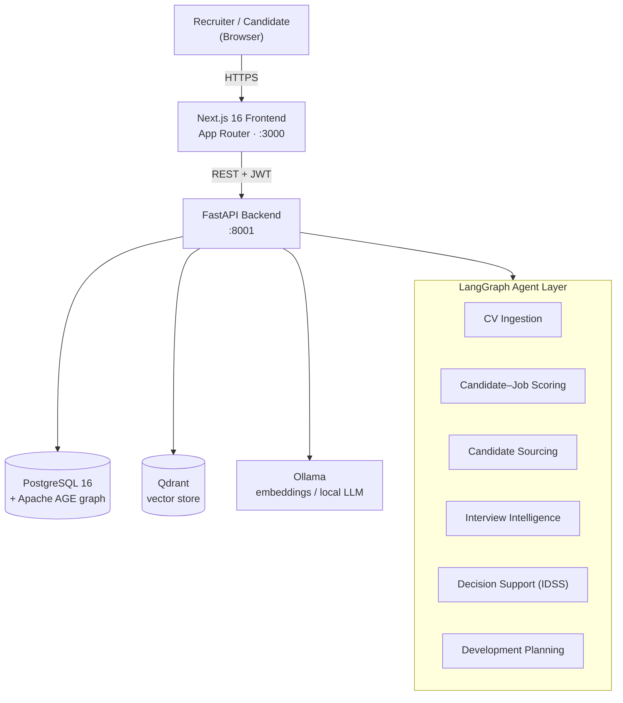

<div align="center">

# PATHS — Personalised AI Talent Hiring System

**Evidence-driven, human-in-the-loop recruitment powered by agentic AI.**

[](LICENSE)
[](backend/requirements.txt)
[](https://fastapi.tiangolo.com/)
[](https://nextjs.org/)
[](https://age.apache.org/)
[](https://qdrant.tech/)
[](docker-compose.yml)

</div>

---

## Overview

**PATHS** is a full-stack platform that supports the entire hiring lifecycle —
from sourcing and CV screening through interviewing to a final, auditable hiring
decision and a personalised development plan. Rather than replacing recruiters,
it acts as a team of specialised **LangGraph agents** that gather evidence, score
candidates against each role, and surface transparent, explainable
recommendations, while a human remains the decision-maker at every gate.

The system was built as a graduation project to explore how *agentic AI* and a
*graph + vector* data model can make recruitment **faster, fairer, and more
transparent**:

- **Evidence-driven** — every score is backed by traceable evidence (CV, GitHub,
  interview transcript) and a weighted rubric, not a black box.
- **Human-in-the-loop** — agents recommend; recruiters and hiring managers decide.
  Sensitive actions (outreach, final decisions) require explicit approval.
- **Explainable** — the Intelligent Decision Support System (IDSS) breaks each
  candidate's score down per pipeline stage with a written justification.

---

## Key features

| Area | What it does |
|---|---|
| **Sourcing** | Find candidates from an internal pool or external connectors and score them against a specific job. |
| **CV screening** | Ingests CVs, extracts skills/experience, and embeds them for semantic matching. |
| **Candidate–job scoring** | Blends an LLM skill-fit assessment with vector similarity into a single match score. |
| **Interview intelligence** | Generates pre-analysis + tailored technical / behavioural question drafts, then analyses the transcript and scores by interview type. |
| **Decision support (IDSS)** | Weighted, per-stage rubric with AI explainability and a human-feedback override; produces a recommendation, confidence, and the next step. |
| **Development planning** | On a hire/reject decision, an agent drafts an 18-month (accept) or 12-month (reject) growth plan. |
| **Auditability** | PDF decision reports with per-stage breakdowns; rejected candidates stay in the database (never silently deleted). |

The hiring pipeline runs through configurable stages:
**Define → Source → Screen → Interview → Decision → Development.**

---

## System architecture



| Layer | Technology |
|---|---|
| Frontend | Next.js 16 (App Router) · React 19 · Tailwind v4 · TanStack Query |
| Backend | FastAPI · SQLAlchemy · Alembic · Pydantic v2 |
| Relational + graph | PostgreSQL 16 + Apache AGE |
| Vector store | Qdrant (candidate + job embeddings) |
| Agents | LangGraph (sourcing, scoring, interview, decision support, development) |
| Models | Ollama (`nomic-embed-text`, local LLM) · OpenRouter (hosted LLMs) |
| Auth | JWT (argon2id password hashing) |

---

## Quick start

### Prerequisites

- **Docker** + Docker Compose (the only requirement for Option A)
- For local development also: **Python 3.11+**, **Node.js 20+**, **pnpm 9+**

### Option A — Run everything with Docker (recommended)

One command builds the images and starts the whole stack (Postgres + AGE,
Qdrant, Ollama, backend, and frontend). The backend **applies its database
migrations automatically** on startup.

```bash
git clone <your-repo-url> paths && cd paths
docker compose up -d --build
```

Then open:

| Service | URL |
|---|---|
| Web app | http://localhost:3000 |
| API docs (Swagger) | http://localhost:8001/docs |

Optional follow-ups:

```bash
# Load a demo dataset (orgs, jobs, candidates, a full pipeline)
docker compose exec backend python -m seed.demo

# Pull the local AI models for full embedding / LLM features
docker compose exec ollama ollama pull nomic-embed-text
docker compose exec ollama ollama pull llama3.1:8b
```

> Copy `.env.example` to `.env` first if you want to override defaults
> (e.g. `SECRET_KEY`, `OPENROUTER_API_KEY`). The stack runs with sensible
> defaults out of the box.

To stop: `docker compose down` (add `-v` to also delete the data volumes).

### Option B — Local development

Start just the infrastructure in Docker, then run the apps on your host with
hot-reload:

```bash
# 1. Infrastructure (Postgres + AGE, Qdrant, Ollama)
docker compose -f backend/docker-compose.yml up -d

# 2. Backend (http://localhost:8001)
cd backend
python -m venv .venv && source .venv/bin/activate     # Windows: .venv\Scripts\activate
pip install -r requirements.txt
cp .env.example .env                                   # defaults target localhost
alembic upgrade head
uvicorn app.main:app --reload --port 8001

# 3. Frontend (http://localhost:3000) — in a second terminal
cd frontend
pnpm install
cp .env.local.example apps/web/.env.local              # sets NEXT_PUBLIC_API_URL
pnpm --filter @paths/web dev

# 4. (optional) demo data
cd backend && python -m seed.demo
```

---

## Configuration

All backend settings are environment variables (see **`backend/.env.example`**
for the full, documented list). The frontend reads
**`frontend/.env.local.example`**. The essentials:

| Variable | Service | Description |
|---|---|---|
| `SECRET_KEY` | backend | 32+ char random string for JWT signing (**change for any non-local use**). |
| `DATABASE_URL` | backend | PostgreSQL connection string. |
| `QDRANT_URL` | backend | Qdrant server URL. |
| `OLLAMA_BASE_URL` | backend | Ollama server URL (embeddings / local LLM). |
| `OPENROUTER_API_KEY` | backend | Hosted LLM inference (optional — an offline fallback is used when blank). |
| `NEXT_PUBLIC_API_URL` | frontend | Backend base URL, baked into the browser bundle at build time. |

With `docker compose`, the service-to-service URLs are wired automatically;
you only need an `.env` to override the defaults documented in `.env.example`.

---

## Project structure

```text
paths/
├── docker-compose.yml          Full-stack orchestration (infra + backend + web)
├── .env.example                Root compose overrides
├── backend/                    FastAPI service
│   ├── app/
│   │   ├── api/v1/             Route handlers
│   │   ├── agents/             LangGraph agents
│   │   ├── services/           Business logic (scoring, decision support, …)
│   │   ├── db/models/          SQLAlchemy ORM models
│   │   ├── core/               Config, security, database
│   │   └── main.py             Application entry point
│   ├── alembic/                Database migrations
│   ├── seed/                   Demo-data generator (`python -m seed.demo`)
│   ├── Dockerfile              Auto-migrates, then serves
│   └── docker-compose.yml      Infrastructure only (for local dev)
├── frontend/                   pnpm workspace
│   └── apps/web/               Next.js application
│       ├── src/app/            Route groups + pages
│       ├── src/components/     UI + feature components
│       └── src/lib/            API client + React Query hooks
├── docs/                       Architecture, database, walkthroughs, checklists
└── scripts/                    Smoke test
```

---

## Deployment

The repository is deployment-ready via the root `docker-compose.yml`:

1. Provision a host with Docker, clone the repo, and create a `.env`
   (start from `.env.example`). **Set a strong `SECRET_KEY`** and, for the
   production guard, `APP_ENV=production`.
2. `docker compose up -d --build` — migrations run automatically on first boot,
   and Apache AGE is initialised via `backend/scripts/init_age.sql`.
3. Put a reverse proxy (e.g. Caddy / Nginx) in front to terminate TLS and route
   `:3000` (web) and `:8001` (API).

The frontend image builds Next.js in **standalone** mode and bakes
`NEXT_PUBLIC_API_URL` at build time, so point it at your public API URL via the
`web.build.args` / `NEXT_PUBLIC_API_URL` variable before building.

---

## Testing

```bash
# Backend
cd backend && pytest

# Frontend type-check
cd frontend && pnpm --filter @paths/web exec tsc --noEmit
```

---

## Documentation

| Document | Description |
|---|---|
| [Architecture blueprint](docs/PATHS_Deep_Architecture_Blueprint.md) | Deep architecture and design rationale. |
| [Recommendation system](docs/RECOMMENDATION_SYSTEM.md) | Content-based matching, scoring & ranking. |
| [PATHy assistant](docs/PATHy.md) | The in-app context-aware support chatbot. |
| [Project walkthrough](docs/PATHS_PROJECT_WALKTHROUGH.md) | End-to-end product tour. |
| [Database design](docs/DDBB.md) | Schema, graph model, and entities. |
| [Find-talent workflow](docs/FIND_TALENT_WORKFLOW.md) | Sourcing pipeline. |
| [Implementation checklist](docs/PATHS_Implementation_Checklist.md) | Feature-by-feature status. |
| [Production checklist](docs/PRODUCTION_CHECKLIST.md) | Go-live readiness. |
| [Contributing](CONTRIBUTING.md) | Development workflow and conventions. |

---

## License

Released under the [MIT License](LICENSE).
