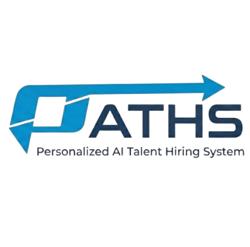
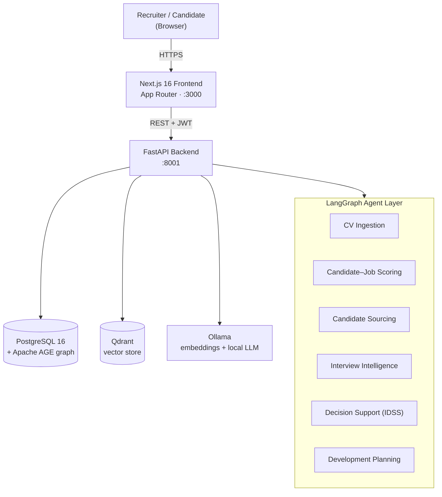

<div align="center">

# PATHS - Personalised AI Talent Hiring System



**Evidence-driven, human-in-the-loop recruitment powered by agentic AI.**

[](#demonstration)
[](backend/requirements.txt)
[](https://fastapi.tiangolo.com/)
[](https://nextjs.org/)
[](https://age.apache.org/)
[](https://qdrant.tech/)
[](https://ollama.com/)
[](https://langchain-ai.github.io/langgraph/)
[](docker-compose.yml)

</div>

---

## Table of contents

1. [Overview](#overview)
2. [Key features](#key-features)
3. [System architecture](#system-architecture)
4. [Tech stack & libraries](#tech-stack--libraries)
5. [Repository structure](#repository-structure)
6. [Quick start](#quick-start)
7. [Demonstration](#demonstration)
8. [Configuration](#configuration)
9. [API](#api)
10. [Testing & evaluation](#testing--evaluation)
11. [Deployment](#deployment)
12. [Documentation](#documentation)
13. [Submission checklist](#submission-checklist)
14. [License](#license)

---

## Overview

**PATHS** is a full-stack platform that supports the entire hiring lifecycle —
from sourcing and CV screening, through interviewing, to a final, auditable
hiring decision and a personalised development plan. Rather than replacing
recruiters, it acts as a team of specialised **LangGraph agents** that gather
evidence, score candidates against each role, and surface transparent,
explainable recommendations — while a human remains the decision-maker at every
gate.

The system was built as a graduation project to explore how *agentic AI* and a
combined *graph + vector* data model can make recruitment **faster, fairer, and
more transparent**:

- **Evidence-driven** — every score is backed by traceable evidence (CV, GitHub,
  interview transcript) and a weighted rubric, not a black box.
- **Human-in-the-loop** — agents recommend; recruiters and hiring managers decide.
  Sensitive actions (de-anonymisation, outreach, final decisions) require explicit
  human approval.
- **Explainable** — the Intelligent Decision Support System (IDSS) breaks each
  candidate's score down per pipeline stage with a written justification.
- **Private by default** — all AI inference (embeddings + LLM) runs **locally via
  Ollama**; no external AI API key is required to demo the system.

---

## Key features

| Area | What it does |
|---|---|
| **Sourcing** | Find candidates from an internal pool or external connectors (incl. an MCP-based LinkedIn provider) and score them against a specific job. |
| **CV screening** | Ingests CVs (PDF/DOCX), extracts skills / experience / education, and embeds them for semantic matching. |
| **Candidate–job scoring** | Blends an LLM skill-fit assessment with vector similarity into a single, weighted match score with an explanation. |
| **Interview intelligence** | Generates a candidate pre-analysis plus tailored **technical** and **HR / behavioural** question drafts, then analyses the transcript and scores by interview type. |
| **Decision support (IDSS)** | Weighted, per-stage rubric with AI explainability and a human-feedback override; produces a recommendation, confidence, and the next step. |
| **Development planning** | On a hire/reject decision, an agent drafts an 18-month (accept) or 12-month (reject) growth plan. |
| **Fairness & anonymisation** | Candidate identity is hidden from the scoring/interview agents; a disparate-impact (four-fifths) bias guardrail runs on screening. |
| **Platform admin tooling** | A control plane for organisations, users, agent runs, feature flags, system health, and a live **Knowledge Graph & Vector DB** inspector. |
| **Auditability** | PDF decision reports with per-stage breakdowns; rejected candidates stay in the database (never silently deleted). |

The hiring pipeline runs through configurable stages:
**Define → Source → Screen → Interview → Decision → Development.**

### User roles

| Role | Capabilities |
|---|---|
| **Candidate** | Register, complete a profile / upload a CV, discover jobs, view applications and a personalised development plan. |
| **Recruiter / HR** | Create jobs, source and screen candidates, run matching, prepare interviews, manage outreach. |
| **Hiring Manager** | Review the decision packet and make the final hire/reject decision. |
| **Organization Admin** | Manage the organisation, members, knowledge base, and approve sensitive actions. |
| **Platform Admin** | Operate the platform: organisations, users, analytics, agent monitoring, feature flags, Graph & Vector DB inspector. |

---

## System architecture



**Three-tier, polyglot-persistence design:** a thin Next.js client (no direct DB
access) → a FastAPI modular-monolith backend (all business logic, agents, auth) →
three specialised data stores, each used for what it does best.

| Layer | Technology |
|---|---|
| Frontend | Next.js 16 (App Router) · React 19 · Tailwind v4 · TanStack Query · Zustand |
| Backend | FastAPI · SQLAlchemy · Alembic · Pydantic v2 · LangGraph |
| Relational + graph | PostgreSQL 16 + Apache AGE (graph `paths_graph`) |
| Vector store | Qdrant (candidate + job + document embeddings, 768-dim, cosine) |
| AI models | **Ollama** — `nomic-embed-text` (embeddings) + `llama3.1:8b` (local LLM) |
| Auth | JWT (argon2id password hashing) + role-based access control |

---

## Tech stack & libraries

All dependencies are declared in **`backend/requirements.txt`** (Python) and
**`frontend/apps/web/package.json`** (Node).

**Backend (Python 3.11+)**

| Concern | Libraries |
|---|---|
| Web / API | FastAPI, Uvicorn, Pydantic v2, pydantic-settings |
| Data / ORM | SQLAlchemy, Alembic, psycopg (PostgreSQL), Apache AGE (Cypher) |
| Vector / AI | qdrant-client, LangGraph, LangChain, langchain-ollama |
| Documents | pypdf, python-docx, beautifulsoup4, reportlab (PDF reports) |
| Auth / security | PyJWT, passlib, argon2-cffi, bcrypt, cryptography, bleach |
| Integrations | httpx, requests, stripe, google-api-python-client, APScheduler |
| Observability | prometheus-fastapi-instrumentator, sentry-sdk, OpenTelemetry |
| Testing | pytest, pytest-asyncio |

**Frontend (Node 20+, pnpm)**

| Concern | Libraries |
|---|---|
| Framework / UI | Next.js 16, React 19, TypeScript 5 |
| State / data | Zustand, TanStack React Query |
| Forms / validation | React Hook Form, Zod |
| Styling | Tailwind CSS 4, shadcn/ui, Base UI, lucide-react, framer-motion |
| Data viz | Recharts |
| Tooling | pnpm, ESLint |

**Infrastructure:** Docker & Docker Compose · PostgreSQL+AGE · Qdrant · Ollama.

---

## Repository structure

```text
paths/
├── README1.md                  This file
├── docker-compose.yml          Full-stack orchestration (infra + backend + web)
├── .env.example                Root compose overrides
│
├── backend/                    FastAPI service (Python)
│   ├── app/
│   │   ├── api/v1/             REST route handlers (auth, jobs, candidates, …)
│   │   ├── agents/             LangGraph agents (cv_ingestion, sourcing,
│   │   │                       screening, interview_intelligence,
│   │   │                       decision_support, outreach, job_ingestion)
│   │   ├── services/           Business logic (scoring, decision support,
│   │   │                       skill_evidence, company_knowledge, outreach, …)
│   │   ├── db/
│   │   │   ├── models/         SQLAlchemy ORM models
│   │   │   └── repositories/   Data access (incl. AGE graph + Qdrant vector)
│   │   ├── core/               Config, security (argon2id JWT), database
│   │   ├── utils/              AGE Cypher helper, PDF builders, …
│   │   └── main.py             Application entry point (mounts all routers)
│   ├── alembic/                Database migrations
│   ├── scripts/init_age.sql    Apache AGE init (runs on first DB boot)
│   ├── seed/demo.py            Demo-data generator (`python -m seed.demo`)
│   ├── requirements.txt        Python dependencies
│   ├── .env.example            Documented backend environment variables
│   ├── Dockerfile              Auto-migrates, then serves
│   └── docker-compose.yml      Infrastructure only (Postgres+AGE, Qdrant, Ollama)
│
├── frontend/                   pnpm workspace (Node / TypeScript)
│   └── apps/web/               Next.js 16 application
│       ├── public/             Static assets (incl. paths-logo.png)
│       ├── src/app/            Route groups + pages
│       │                       (admin) (auth) (dashboard) candidate onboarding …
│       ├── src/components/     UI + feature components
│       ├── src/lib/            API client + React Query hooks + Zustand stores
│       ├── src/middleware.ts   Route guard (session check)
│       ├── package.json        Frontend dependencies
│       └── .env.local.example  → copy to apps/web/.env.local
│
|__ e2e/                        Playwright end-to-end tests (all roles)
    └── tests/                  auth.setup · public · api · admin · candidate · org


```

---

## Quick start

### Prerequisites

- **Docker** + Docker Compose (the only requirement for Option A)
- For local development also: **Python 3.11+**, **Node.js 20+**, **pnpm 9+**

### Option A — Run everything with Docker (recommended for demo)

One command builds the images and starts the whole stack (Postgres + AGE,
Qdrant, Ollama, backend, and frontend). The backend **applies its database
migrations automatically** on startup, and Apache AGE is initialised on first
boot.

```bash
git clone <your-repo-url> paths && cd paths
docker compose up -d --build
```

Then open:

| Service | URL |
|---|---|
| Web app | http://localhost:3000 |
| API docs (Swagger) | http://localhost:8001/docs |

Load demo data and the local AI models (one-time):

```bash
# Demo dataset (orgs, jobs, candidates, a full pipeline + login accounts)
docker compose exec backend python -m seed.demo

# Pull the local AI models for embeddings + LLM features
docker compose exec ollama ollama pull nomic-embed-text
docker compose exec ollama ollama pull llama3.1:8b
```

> Copy `.env.example` to `.env` first to override defaults (e.g. `SECRET_KEY`).
> The stack runs on sensible defaults out of the box, and because all AI
> inference is local via Ollama, **no external API key is needed**.

Stop the stack: `docker compose down` (add `-v` to also delete data volumes).

### Option B — Local development (hot-reload)

```bash
# 1. Infrastructure (Postgres + AGE, Qdrant, Ollama)
docker compose -f backend/docker-compose.yml up -d

# 2. Backend (http://localhost:8001)
cd backend
python -m venv .venv && source .venv/bin/activate     # Windows: .venv\Scripts\activate
pip install -r requirements.txt
cp .env.example .env                                   # defaults target localhost
alembic upgrade head
uvicorn app.main:app --reload --port 8001

# 3. Frontend (http://localhost:3000) — second terminal
cd frontend
pnpm install
cp .env.local.example apps/web/.env.local              # sets NEXT_PUBLIC_API_URL
pnpm --filter @paths/web dev

# 4. Demo data + local models
cd backend && python -m seed.demo
ollama pull nomic-embed-text && ollama pull llama3.1:8b
```

---

## Demonstration

The repository is **demo-ready**. After `docker compose up -d --build` and
`python -m seed.demo`, open **http://localhost:3000** and log in with the seeded
accounts:

| Role | Email | Password |
|---|---|---|
| **Platform Admin** | `admin@paths.ai` | `Admin@123!` |
| **Recruiter / HR** | `recruiter@<org-slug>.demo` | `Recruiter@123!` |

*(The exact recruiter email per demo organisation is printed by `seed.demo` when
it runs. Candidates can also self-register from the sign-up page.)*

**Suggested 5-minute walkthrough**

1. **Recruiter** → create or open a job, then **run matching / screening** to see
   the ranked, explained candidate shortlist.
2. Open a candidate → **interview intelligence** (pre-analysis + technical/HR
   question drafts) and the **decision-support** packet.
3. Approve a decision → an **outreach message** and a **development plan** are
   drafted for human review.
4. **Platform Admin** → `Graph & Vector DB` to inspect the live Apache AGE
   knowledge graph and the Qdrant vector store; `System Health`, `Analytics`,
   `Agent Monitor`.

Health checks: API root `http://localhost:8001/` and Swagger
`http://localhost:8001/docs`.

---

## Configuration

All backend settings are environment variables (see **`backend/.env.example`**
for the full, documented list). The frontend reads
**`frontend/.env.local.example`**. The essentials:

| Variable | Service | Description |
|---|---|---|
| `SECRET_KEY` | backend | 32+ char random string for JWT signing (**change for any non-local use**). |
| `DATABASE_URL` | backend | PostgreSQL connection string. |
| `QDRANT_URL` | backend | Qdrant server URL. |
| `OLLAMA_BASE_URL` | backend | Ollama server URL — powers **both** embeddings and the local LLM. |
| `NEXT_PUBLIC_API_URL` | frontend | Backend base URL, baked into the browser bundle at build time. |

With `docker compose`, the service-to-service URLs are wired automatically; you
only need an `.env` to override the documented defaults.

---

## API

The backend exposes a versioned REST API under **`/api/v1`**, fully documented
and explorable via **Swagger UI at `http://localhost:8001/docs`** (OpenAPI JSON at
`/openapi.json`). Authentication is **JWT bearer** (`Authorization: Bearer <token>`)
obtained from `POST /api/v1/auth/login`; routes are gated by role.

| Group | Purpose |
|---|---|
| `/api/v1/auth` | Register, login (JWT), session |
| `/api/v1/candidates` | Candidate profiles, applications, skills evidence |
| `/api/v1/jobs` | Job CRUD, requirements |
| `/api/v1/scoring`, `/api/v1/screening` | Candidate–job scoring & ranked screening |
| `/api/v1/recruiter/source-candidate`, `/api/v1/sourcing` | Candidate sourcing (incl. MCP) |
| `/api/v1/interviews`, `/api/v1/interview-runtime` | Interview scheduling, transcript analysis |
| `/api/v1/decision-support`, `/api/v1/idss` | Decision packets, weighted rubric, development plans |
| `/api/v1/outreach-agent`, `/api/v1/company-knowledge` | Outreach drafts, org knowledge base (RAG) |
| `/api/v1/admin/...` | Platform admin: orgs, users, agent runs, system health, Graph & Vector DB |

---

## Testing & evaluation

```bash
# Backend — unit & integration tests
cd backend && pytest

# Frontend — type-check
cd frontend && pnpm --filter @paths/web exec tsc --noEmit

# End-to-end (Playwright, all personas) — requires the stack running
cd e2e && npx playwright test
```

The system has been evaluated end-to-end (full-stack E2E across every role,
backend unit/integration tests, a controlled candidate–job matching scenario, and
a RAG retrieval/generation evaluation). See **[docs/](docs/)** —
`TEST.md`, `RES.md`, `RAG.md`, and `SCORE.md`.

---

## Deployment

The repository is deployment-ready via the root `docker-compose.yml`:

1. Provision a host with Docker, clone the repo, and create a `.env`
   (start from `.env.example`). **Set a strong `SECRET_KEY`** and, for the
   production guard, `APP_ENV=production`.
2. `docker compose up -d --build` — migrations run automatically on first boot,
   and Apache AGE is initialised via `backend/scripts/init_age.sql`.
3. Put a reverse proxy (e.g. Caddy / Nginx) in front to terminate TLS and route
   `:3000` (web) and `:8001` (API).
4. Pull the Ollama models once (`nomic-embed-text`, `llama3.1:8b`).

The frontend image builds Next.js in **standalone** mode and bakes
`NEXT_PUBLIC_API_URL` at build time — point it at your public API URL via the
`web.build.args` / `NEXT_PUBLIC_API_URL` variable before building.

---

## Documentation

[**Graduation Project Report**](https://drive.google.com/drive/folders/1lwA_RvoNazmBx0b0o5cKoFcHfMci8lgS?usp=sharing)

---

## Submission checklist

What the uploaded repository contains, mapped to the submission requirements:

| Requirement | Where |
|---|---|
| **Source code** | `backend/` (FastAPI + LangGraph agents) · `frontend/` (Next.js) |
| **Libraries / dependencies** | `backend/requirements.txt` · `frontend/apps/web/package.json` |
| **APIs** | Versioned REST under `/api/v1`, Swagger at `:8001/docs` ([API](#api)) |
| **Documentation** | `README1.md` (this file) + [`docs/`](docs/) |
| **Setup & execution instructions** | [Quick start](#quick-start) + [Demonstration](#demonstration) |
| **Fully functional & demo-ready** | `docker compose up -d --build` + `python -m seed.demo` → log in with the seeded accounts |

---

## License

This project was developed as an academic **graduation project**. © 2026 the
PATHS team. All rights reserved unless a separate `LICENSE` file is added to the
repository.
